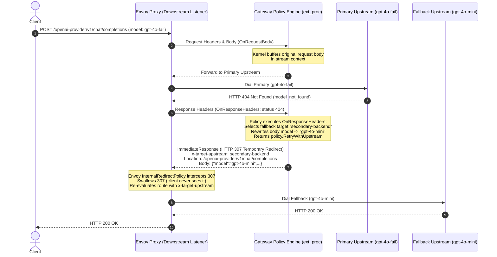

# Implementation Plan: Option D / Mechanism 1 (Envoy Internal Redirects)

## 1. Overview & Goal

**Goal:** Implement a generic, reactive retry capability in the Gateway Runtime and SDK where any policy can inspect an upstream error response in `OnResponseHeaders` or `OnResponseBody` and return a `RetryWithUpstream` action. Envoy executes the retry transparently using its native `internal_redirect_policy`.

**Key Benefits:**
1. **Zero Compile-Time Cluster Synthesis**: No need to generate Envoy aggregate clusters or pre-compute priority trees in xDS.
2. **Body-Aware Failover**: Policies can inspect JSON error bodies (e.g. `error.code == "insufficient_quota"` or `model_not_found`) to decide whether to fail over, rather than being limited to HTTP status codes.
3. **Completely Decoupled**: The `model-failover` policy is 100% self-contained in `gateway-controllers` with zero xDS translator coupling.

---

## 2. Architecture & Data Flow



---

## 3. Specification & API Contracts

### 3.1 Policy SDK Extension (`sdk/core/policy/v1alpha2`)

#### Action Definition in `action.go`:
```go
// RetryWithUpstream instructs the gateway kernel to abort delivering the current
// upstream failure response to the downstream client, and instead retry the request
// against a different upstream cluster with an optional mutated request body.
type RetryWithUpstream struct {
    // UpstreamName is the logical name of the target upstreamDefinition (or "" for main).
    UpstreamName string

    // MutatedBody replaces the request body for the retried attempt.
    // If nil, the original buffered request body is replayed.
    MutatedBody []byte

    // HeadersToSet adds or overwrites request headers on the retried attempt.
    HeadersToSet map[string]string

    // HeadersToRemove removes request headers on the retried attempt.
    HeadersToRemove []string
}

// Satisfies ResponseHeaderAction and ResponseBodyAction interfaces
func (r RetryWithUpstream) isResponseHeaderAction() {}
func (r RetryWithUpstream) isResponseBodyAction()   {}
```

#### Context Extension in `context.go`:
```go
type ResponseHeaderContext struct {
    *SharedContext
    ResponseHeaders *Headers
    
    // OriginalRequestBody carries the buffered client request body (available when
    // RequestBodyMode is BUFFERED).
    OriginalRequestBody []byte

    // AttemptCount indicates which attempt produced this response (starts at 1).
    AttemptCount int
}
```

---

### 3.2 Envoy `internal_redirect_policy` Configuration (`gateway-controller`)

In `gateway-controller/pkg/xds/translator.go`, configure internal redirect policy on any route using dynamic cluster selection (`UseClusterHeader = true`):

```go
// Enable Envoy native internal redirects on 307
routeAction.Route.InternalRedirectPolicy = &route.InternalRedirectPolicy{
    MaxInternalRedirects: wrapperspb.UInt32(5),
    RedirectResponseCodes: []uint32{307},
    ResponseHeadersToCopy: []*route.InternalRedirectPolicy_ResponseHeaderToCopy{
        {
            Name:          constants.TargetUpstreamHeader, // x-target-upstream
            KeepIfPresent: true,
        },
    },
}
```

---

### 3.3 Ext_Proc Kernel Translation (`gateway-runtime`)

In `gateway-runtime/policy-engine/internal/kernel/extproc.go`:
When a policy returns `policy.RetryWithUpstream`:
1. Check if `AttemptCount < MaxAttempts`.
2. Construct Envoy `extprocv3.ImmediateResponse`:
   * Status Code: `307 Temporary Redirect`.
   * Header `Location`: original request path.
   * Header `x-target-upstream`: `retryAction.UpstreamName`.
   * Header `x-envoy-attempt-count`: `AttemptCount + 1`.
   * Body: `retryAction.MutatedBody` (or buffered original body).
3. Send `ProcessingResponse{ImmediateResponse: ...}` to Envoy.
4. Envoy's `internal_redirect_policy` catches the 307, reads the new `x-target-upstream`, and re-dispatches to the new cluster.

---

## 4. Policy Implementation Example

In `gateway-controllers/policies/model-failover/model_failover.go`:

```go
package modelfailover

import (
    "context"
    "encoding/json"
    "time"
    policy "github.com/wso2/api-platform/sdk/core/policy/v1alpha2"
)

type Policy struct {
    targets     []targetGroup
    targetByModel map[string]targetGroup
    statusCodes map[int]struct{}
}

func (p *Policy) Mode() policy.ProcessingMode {
    return policy.ProcessingMode{
        RequestHeaderMode:  policy.HeaderModeSkip,
        RequestBodyMode:    policy.BodyModeBuffer,
        ResponseHeaderMode: policy.HeaderModeProcess,
        ResponseBodyMode:   policy.BodyModeSkip,
    }
}

func (p *Policy) OnResponseHeaders(ctx context.Context, rhctx *policy.ResponseHeaderContext, _ map[string]interface{}) policy.ResponseHeaderAction {
    statusCode := rhctx.ResponseHeaders.StatusCode()
    if _, matches := p.statusCodes[statusCode]; !matches {
        return policy.DownstreamResponseHeaderModifications{} // Success or non-retriable: pass to client
    }

    var body map[string]interface{}
    if err := json.Unmarshal(rhctx.OriginalRequestBody, &body); err != nil {
        return policy.DownstreamResponseHeaderModifications{}
    }

    modelName, _ := body["model"].(string)
    group, ok := p.targetByModel[modelName]
    if !ok || len(group.fallbacks) == 0 {
        return policy.DownstreamResponseHeaderModifications{}
    }

    fallbackIdx := rhctx.AttemptCount - 1
    if fallbackIdx >= len(group.fallbacks) {
        return policy.DownstreamResponseHeaderModifications{} // Fallbacks exhausted
    }

    fallback := group.fallbacks[fallbackIdx]
    body["model"] = fallback.model
    mutatedBody, _ := json.Marshal(body)

    return policy.RetryWithUpstream{
        UpstreamName: fallback.upstreamDefinition,
        MutatedBody:  mutatedBody,
    }
}
```

---

## 5. Implementation Tasks

### Phase 1: SDK Additions (`api-platform/sdk`)
- [ ] **Task 1.1**: Add `RetryWithUpstream` struct to `sdk/core/policy/v1alpha2/action.go`.
- [ ] **Task 1.2**: Add `OriginalRequestBody` and `AttemptCount` to `ResponseHeaderContext` and `ResponseBodyContext` in `sdk/core/policy/v1alpha2/context.go`.

### Phase 2: Gateway Controller xDS (`api-platform/gateway/gateway-controller`)
- [ ] **Task 2.1**: In `pkg/xds/translator.go`, attach `InternalRedirectPolicy` to routes configured with `UseClusterHeader = true`.
- [ ] **Task 2.2**: Remove aggregate cluster generation loops and `p.Name == "model-failover"` branches from `translator.go`.

### Phase 3: Gateway Runtime Kernel (`api-platform/gateway/gateway-runtime`)
- [ ] **Task 3.1**: In `extproc.go`, buffer request bodies in stream context during `RequestBodyMode: BUFFERED`.
- [ ] **Task 3.2**: In `extproc.go`, handle `RetryWithUpstream` returned from `OnResponseHeaders`/`OnResponseBody` by emitting an `ImmediateResponse` (HTTP 307 with `x-target-upstream`).

### Phase 4: Model Failover Policy Update (`gateway-controllers`)
- [ ] **Task 4.1**: Refactor `gateway-controllers/policies/model-failover/model_failover.go` to use `OnResponseHeaders` with `RetryWithUpstream`.
- [ ] **Task 4.2**: Update `policy-definition.yaml` to remove aggregate cluster requirements.

---

## 6. Verification & Test Plan

1. **Unit Tests**:
   - `cd sdk/core && go test ./policy/v1alpha2/... -v`
   - `cd gateway/gateway-runtime && go test ./policy-engine/... -v`
   - `cd gateway/gateway-controller && go test ./pkg/xds/... -v`
2. **E2E Integration Verification**:
   - Verify Envoy intercepts 307 internally and dials fallback upstream without exposing 307 to the client.
   - Run end-to-end failover tests with `curl` against `POST /openai-provider/v1/chat/completions` using invalid model `gpt-4o-asas`.
