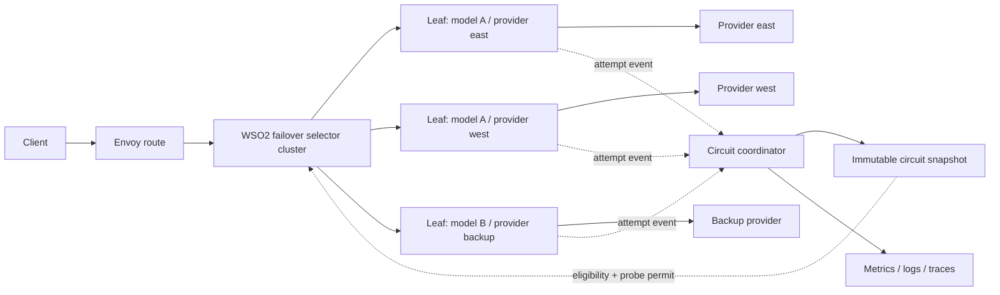

# LLM Model Failover — Implementation Specification

**Status:** Proposed  
**Scope:** Production implementation contract  
**Data plane:** Envoy 1.39+ with a WSO2 failover selector extension  
**Health identity:** policy scope + provider configuration + model  
**Non-goal:** deployment and endpoint fields in the failover policy

**Source requirement:** `wso2-enterprise/wso2-apim-internal#18469` — ECI multi-region Azure Foundry failover

## 1. Purpose

This specification defines how to implement model failover without the known-bad downstream bypass. A suspended member must be skipped while the request retains access to every later eligible member in the chain.

Regional deployments are modeled as separate provider configurations. Deployment names, endpoint URLs, credentials, API versions, and provider-specific paths remain inside the provider definition and do not appear in the failover contract.

The implementation must support:

- the same model through multiple regional providers;
- different models through the same or different providers;
- deterministic, non-repeating failover across an arbitrary chain;
- rolling and consecutive failure criteria;
- percentile-based latency criteria;
- timed suspension with controlled half-open recovery; and
- auditable selection and circuit transitions.

The customer scenario is ordered active/passive routing from an Azure provider configured for Sweden to another configured for Spain. This is explicitly not load balancing: while the primary is healthy, the secondary receives no ordinary production traffic.

### 1.1 Product and release boundary

Issue `#18469` covers both the full circuit-breaker feature and an urgent APIM 4.6/4.7 U2 request for transport-level failover. They are separate deliverables:

| Deliverable | Required behavior | This specification |
|---|---|---|
| API Platform / AI Gateway circuit breaker | HTTP status, connection failure, timeout, hung upstream, aggregate latency, suspension, half-open recovery, and audit telemetry | Defined in full |
| APIM 4.6/4.7 U2 transport-failover backport | A connection failure, timeout, or hung primary can reach the next configured endpoint | Compatibility workstream only; must have its own implementation plan and must not claim the complete circuit-breaker contract |

The backport may reuse compatible concepts, but it must not delay or weaken the production architecture defined here.

## 2. Architectural decision

The implementation has four parts:

1. **Gateway controller compiler** validates policy configuration and emits one leaf cluster per chain member plus one selector cluster per chain.
2. **Envoy failover selector extension** chooses the next eligible member from the complete chain. Selection advances from the member actually attempted, not from a raw retry counter.
3. **Circuit coordinator in the policy runtime** aggregates attempt outcomes and owns `CLOSED`, `OPEN`, and `HALF_OPEN` state.
4. **State snapshot bridge** publishes an immutable circuit snapshot to the Envoy selector. The request path only reads this snapshot; it does not make synchronous control-plane calls.



### 2.1 Why a custom selector is required

Envoy aggregate clusters cannot be combined reliably with priority-load retry plugins. Envoy composite clusters advance by retry attempt number and cannot skip an arbitrary member already known to be unavailable. Native outlier detection does not provide the required latency rules or bounded half-open state.

A controller could generate one suffix composite per position:

```text
S0 = [A, B, C, D]
S1 = [B, C, D]
S2 = [C, D]
S3 = [D]
```

The downstream policy can inspect circuit state, find the first eligible position, and enter its suffix. This is linear in chain length and is a material improvement over the current single-leaf bypass: if `A` is open, entering `S1` preserves `B → C → D`.

It does not provide arbitrary-member skipping. Consider state `A=CLOSED, B=OPEN, C=CLOSED`. The policy must enter `S0` because `A` is the first eligible member. If `A` fails in this request, the composite advances by retry count to `B`. It cannot consult policy circuit state and jump to `C`. If `B` remains routable, the request violates the open circuit and calls it. If `B` is represented as unhealthy/ejected, Envoy fails host selection with `no healthy upstream` and does not reliably advance to `C`. The same hole can arise naturally when a fallback remains suspended after the primary has recovered, or when target health is shared across chains.

| Required property | Suffix composites | Custom selector |
|---|---:|---:|
| Skip an open prefix | Yes | Yes |
| Preserve the rest of the chain after skipping a prefix | Yes | Yes |
| Never repeat or wrap | Yes | Yes |
| Skip an open member after an eligible member | No | Yes |
| Admit a half-open member only with a probe permit | No | Yes |
| React to a circuit snapshot on every retry selection | No | Yes |

A stock-Envoy suffix design is therefore sufficient only if the product explicitly adopts a **prefix-only availability invariant**: after the first eligible member, every later member is treated as eligible for that request regardless of its circuit state. That is weaker than the independent per-provider/model circuit contract in this specification.

For the full contract, the production runtime needs a retry-time selection mechanism. The recommended mechanism remains a small Envoy cluster/load-balancer extension and a custom Envoy image. Suffix composites are a valid stock-Envoy interim mode and should replace the current single-leaf bypass if an interim implementation is required, but they are not the final arbitrary-skip selector.

## 3. Configuration contract

Author-facing policy configuration:

```yaml
operationPolicies:
  - name: model-failover
    version: v1
    paths:
      - path: /chat/completions
        methods: [POST]
    params:
      targets:
        - model: gpt-4o
          provider: azure-eastus
          fallbacks:
            - model: gpt-4o
              provider: azure-westus
            - model: gpt-4.1
              provider: openai-backup

      failurePolicy:
        statusCodes: [429, 500, 502, 503, 504]
        includeConnectFailures: true
        includeResets: true
        includeTimeouts: true
        excludeClientCancellations: true
        consecutiveFailures: 5
        failureRate:
          window: 30s
          buckets: 10
          minimumSamples: 20
          thresholdPercent: 40

      latencyPolicy:
        metric: first-response-byte
        percentile: 95
        threshold: 2500ms
        minimumSamples: 20
        consecutiveBreachedWindows: 3

      recoveryPolicy:
        suspension: 60s
        maximumSuspension: 15m
        backoffMultiplier: 2
        jitterPercent: 20
        probeInterval: 5s
        maximumConcurrentProbes: 1
        successfulProbesToClose: 3
        failedProbesToReopen: 1

      retryPolicy:
        perTryTimeout: 10s
        maximumConcurrentRetries: 3
```

`perTryTimeout` is mandatory when hung-upstream failover is enabled. A backend that accepts a connection but never produces response headers must be classified as an attempt timeout, recorded against the selected target, and advanced to the next eligible member while the overall route deadline still has sufficient budget.

### 3.1 Provider ownership

The referenced provider owns:

- endpoint and region;
- provider deployment name;
- credentials and secret references;
- API version and base path;
- TLS and connection properties; and
- provider-specific request/response transformations.

The model-failover policy must not duplicate any of these fields.

### 3.2 Target identity

The canonical key is:

```text
organization / environment / proxy-or-policy-scope / provider-config-id / model
```

The controller generates a stable opaque `targetId` from this key. URLs and credentials must never be used in metrics labels or state keys.

### 3.3 Validation

The controller rejects configuration when:

- a provider reference does not resolve;
- a chain has fewer than two members or exceeds the platform limit;
- the same `(provider, model)` occurs twice in one chain;
- thresholds, durations, percentages, or sample counts are invalid;
- latency rules omit a minimum sample size;
- recovery probe limits are zero;
- the per-try timeout makes later members unreachable under the route deadline; or
- a retryable operation is not declared replay-safe.

Unknown fields are rejected. Controller-injected fields are not accepted from authored policy input.

### 3.4 Multiple requested models

One policy attachment may contain multiple `targets[]` entries, one per client-requested model. The runtime selects the matching entry from the request payload. Therefore an operation accepting `modelA` and `modelB` does not need chained policy attachments in the API Platform configuration; it needs two entries in the same attachment, each with its own ordered fallback list.

If an older APIM policy surface permits only one target per attachment, that product must use one attachment per requested model. This is a configuration-surface difference, not a change to selector or circuit semantics.

## 4. Compiled runtime contract

The controller converts each chain to an internal definition:

```go
type FailoverChain struct {
    ID      string
    Members []FailoverMember
    Circuit CircuitPolicy
    Retry   RetryPolicy
}

type FailoverMember struct {
    TargetID            string
    Model               string
    ProviderID          string
    LeafClusterName     string
    ProbeLeafClusterName string
}
```

These are conceptual contracts. Exact package names may follow repository conventions, but controller and policy-runtime wire structures must be generated from one versioned protobuf schema rather than maintained as duplicate handwritten Go structs.

### 4.1 xDS output

For each member, emit:

- one normal leaf cluster for production attempts;
- one probe leaf cluster using the same provider transport but an isolated retry/concurrency budget; and
- metadata containing bounded `chain_id`, `target_id`, `provider_id`, `model`, and chain position.

For each chain, emit one `envoy.clusters.model_failover` cluster whose typed configuration contains the ordered leaf names and target IDs.

The route always selects the selector cluster. Downstream policy execution must never replace it with an individual leaf.

## 5. Envoy selector extension

### 5.1 Extension contract

Add a statically linked Envoy cluster extension named:

```text
envoy.clusters.model_failover
```

Its typed configuration contains:

```proto
message ModelFailoverClusterConfig {
  string chain_id = 1;
  repeated Member members = 2;
  string circuit_snapshot_key = 3;
}

message Member {
  string target_id = 1;
  string cluster = 2;
  string probe_cluster = 3;
}
```

The extension must use Envoy filter state to persist request-local selection state:

```text
chainId
attemptedTargetIds
lastSelectedPosition
selectedTargetId
selectionReason
probePermitId (optional)
```

### 5.2 Selection algorithm

On every selection:

1. Read the chain definition and the latest immutable circuit snapshot.
2. Start at `lastSelectedPosition + 1`, or position `0` for the first attempt.
3. Skip members already present in `attemptedTargetIds`.
4. Skip `OPEN` members.
5. Skip `HALF_OPEN` members unless the request carries a valid permit or the selector atomically acquires capacity from the local permit pool.
6. Select the first eligible member and record its position and target ID in filter state.
7. If none is eligible, return failover exhaustion with a distinct response detail.

The selector must never wrap to the beginning of the chain.

```text
select(chain, requestState, snapshot):
  for i from requestState.lastPosition + 1 to chain.length - 1:
    member = chain[i]
    if member.targetId in requestState.attempted: continue
    state = snapshot.state(member.targetId)
    if state == OPEN: continue
    if state == HALF_OPEN and !tryAcquireProbePermit(member.targetId, snapshot.generation): continue
    requestState.record(i, member.targetId)
    return member.cluster
  return EXHAUSTED
```

The snapshot remains immutable. Permit acquisition uses a separate generation-bound atomic counter in the Envoy process, so a snapshot replacement invalidates stale capacity. Coordinated mode additionally requires a coordinator-issued lease ID.

### 5.3 Retry behavior

Retry classification remains in the Envoy route retry policy. When a retry is triggered, the selector runs again against the existing request filter state and advances after the actual selected member. A retry cannot return to an earlier member even if circuit state changes during the request.

No retry is allowed after downstream headers or streaming bytes are committed. All attempts share the route deadline.

### 5.4 Runtime packaging

Add an Envoy source/build directory and Bazel target for the extension, then publish a WSO2 Envoy image derived from the pinned Envoy release. The gateway-runtime Dockerfile must consume that image rather than `envoyproxy/envoy` directly.

The build must include an extension-presence startup check. Gateway startup fails clearly if xDS contains `envoy.clusters.model_failover` but the running Envoy binary lacks it.

## 6. Circuit coordinator

### 6.1 Ownership and placement

Implement the coordinator as a runtime service/library owned by the model-failover policy subsystem, not inside downstream request routing. Both downstream and upstream policy instances use the same coordinator registry keyed by the stable chain ID.

Replace the current unbounded process-global suspension map with a lifecycle-managed registry that supports create, replace, and delete when snapshots change.

### 6.2 Attempt event

Emit exactly one event per completed upstream attempt:

```go
type AttemptEvent struct {
    ChainID       string
    TargetID      string
    RequestID     string
    Timestamp     time.Time
    Outcome       OutcomeType
    StatusCode    int
    Latency       time.Duration
    Streaming     bool
    Probe         bool
    ClientCancelled bool
}
```

`OutcomeType` distinguishes success, HTTP failure, connect failure, reset, timeout, and cancellation. Client cancellation does not penalize a provider.

Transport failures must produce events even when no HTTP response exists. Event publication therefore cannot depend only on `OnResponseHeaders`. The runtime integration must observe upstream connection failure, reset-before-response, and per-try timeout completion paths and associate them with the target selected by Envoy.

Latency is measured for the individual upstream attempt. For streaming calls, the opening signal is time to response headers or first token; complete-stream duration is recorded separately.

### 6.3 Rolling aggregation

For each target, use fixed-duration rotating buckets containing:

- sample count and success count;
- failures by category and HTTP status;
- consecutive qualifying failures;
- mergeable latency histogram; and
- last event time.

Evaluation occurs when an event closes a bucket and on a low-frequency timer so idle open circuits can enter half-open. Do not retain raw request bodies or unbounded latency samples.

### 6.4 Opening rules

A `CLOSED` circuit opens when any enabled rule becomes true:

- consecutive qualifying failures reach the configured threshold;
- qualifying failure rate reaches its threshold after `minimumSamples`; or
- configured latency percentile exceeds its threshold for the configured number of consecutive qualified windows.

One isolated failure or slow request cannot satisfy a rolling rule. Each transition records one primary reason plus the complete evaluation summary.

### 6.5 State machine

```mermaid
stateDiagram-v2
    [*] --> CLOSED
    CLOSED --> OPEN: opening rule satisfied
    OPEN --> HALF_OPEN: suspension expires
    HALF_OPEN --> OPEN: probe failure / probe timeout
    HALF_OPEN --> CLOSED: required probe successes
    OPEN --> OPEN: failed recovery; backoff + jitter
```



`OPEN` traffic is skipped by the selector. On expiry, the coordinator enters `HALF_OPEN` and issues at most the configured probe concurrency. Ordinary production traffic continues through later members.

Probe success closes only after the configured quorum and only when recovery latency is below a lower recovery threshold. Any configured number of probe failures reopens the target with exponential backoff, cap, and jitter.

### 6.6 Probes

Support two probe sources:

- platform-owned synthetic probes; and
- sampled real requests explicitly granted a probe permit.

Synthetic probes are preferred for predictable recovery. They must use the same provider configuration and network path, but use the probe leaf's isolated concurrency and retry budget. Clients cannot set probe headers or obtain permits.

## 7. State snapshot bridge

The coordinator publishes an immutable snapshot containing:

```text
generation
targetId -> state, reason, openUntil, probe permits
```

The Envoy extension reads snapshots without blocking the request path. Use an atomic shared-memory/in-process data source if the coordinator is linked into the runtime; otherwise use a local Unix-domain-socket subscription with last-known-good caching.

Snapshot update failure must not make all providers unavailable:

- retain the last valid snapshot;
- expire stale probe permits;
- report snapshot age; and
- fail closed for half-open admission but continue normal selection from members last known as `CLOSED`.

Initial implementation may keep state local to one gateway replica. A later coordinated mode can aggregate events and lease probes centrally. The mode must be explicit in telemetry because local replicas can temporarily disagree.

## 8. Policy-runtime changes

The `model-failover` runtime policy remains responsible for:

- parsing the client model and selecting the chain;
- per-attempt model rewrite;
- provider-specific metadata used by credential/transform policies;
- attempt outcome and latency publication; and
- response attribution.

It must stop:

- storing routing decisions in `isSuspended` maps;
- returning an individual fallback through `UpstreamName`; and
- setting `x-envoy-max-retries: 0` for suspended-primary bypasses.

All chain requests route to the selector cluster. The actual member is learned from trusted Envoy attempt metadata, never inferred only from retry count.

## 9. Gateway-controller changes

### 9.1 Configuration parsing

Replace the flat suspension fields with nested `failurePolicy`, `latencyPolicy`, `recoveryPolicy`, and `retryPolicy` structures. Preserve no compatibility alias unless product requirements explicitly require one before release.

Controller and runtime policy must share a generated protobuf contract. Remove duplicate hand-maintained parameter structures after migration.

### 9.2 Cluster generation

Replace `buildFailoverCompositeClusters` with selector-cluster generation. Retain dedicated leaf cloning and stable names, but remove composite-specific configuration. Generate probe leaves with separate circuit breakers.

### 9.3 Route generation

The selected model determines the selector cluster and maximum retry budget. The route retry count is `chain length - 1`. Status-code and transport retry classification must exactly match the coordinator's failure classification.

### 9.4 Snapshot lifecycle

When an xDS snapshot is replaced or removed, notify the coordinator to remove obsolete chain definitions and target state after a bounded drain period. A configuration generation prevents outcomes from an old chain mutating a new chain with a reused display name.

## 10. Observability contract

Required transition log:

```json
{
  "event": "llm_target_circuit_transition",
  "chainId": "support-chat",
  "targetId": "t_7c91...",
  "providerId": "azure-eastus",
  "model": "gpt-4o",
  "from": "CLOSED",
  "to": "OPEN",
  "reason": "failure_rate",
  "samples": 42,
  "failureRate": 0.381,
  "p95LatencyMs": 2840,
  "openUntil": "2026-09-23T10:31:00Z"
}
```

Required metrics:

- `llm_failover_attempts_total{target,outcome}`
- `llm_failover_selected_total{chain,target,position,reason}`
- `llm_failover_retries_total{from_target,to_target,reason}`
- `llm_failover_exhausted_total{chain}`
- `llm_circuit_state{target}`
- `llm_circuit_transitions_total{target,from,to,reason}`
- `llm_circuit_probe_total{target,outcome}`
- `llm_target_attempt_latency_seconds{target,mode}`
- `llm_circuit_snapshot_age_seconds`

Trace attributes include chain ID, target ID, provider ID, model, position, circuit state, retry reason, probe flag, and remaining deadline. Raw endpoints, secrets, prompts, and arbitrary client IDs are forbidden labels.

## 11. Security and trust boundaries

- Strip all client-supplied selection, retry, target, circuit, and probe headers.
- Accept selected-member metadata only from the local Envoy extension.
- Apply credentials after member selection and remove previous-attempt credentials before retry transformation.
- Keep probe APIs local and authenticated.
- Apply standard prompt/completion redaction to attempt telemetry.
- Enforce configured cross-region and cross-provider data-governance rules before accepting a chain.

## 12. Failure behavior

- **All members open:** return a distinct `503` failover-exhausted response without attempting an open target.
- **Connection refused/reset:** record a qualifying transport failure and advance immediately when retry budget permits.
- **Connected but hung upstream:** terminate at `perTryTimeout`, record a timeout, and advance while preserving the overall deadline.
- **Coordinator unavailable:** use the last valid snapshot; never synchronously block inference traffic on it.
- **Snapshot absent at startup:** treat configured members as closed, disable half-open permits, and emit a degraded-health signal.
- **Extension missing:** reject the xDS resource and fail gateway readiness.
- **Probe subsystem unavailable:** leave targets open until a probe can be controlled; do not release normal traffic as a substitute.
- **Telemetry exporter unavailable:** routing continues; bounded telemetry buffers drop with a counter.

## 13. Implementation sequence

### Phase 1 — shared contracts and observe-only coordinator

1. Introduce versioned protobufs for policy configuration, chain definition, attempt event, and circuit snapshot.
2. Add strict controller validation and provider/model target IDs.
3. Publish per-attempt events from the policy runtime.
4. Implement rolling buckets, histograms, and the state machine in observe-only mode.
5. Add transition and selection telemetry without changing routing.

### Phase 2 — Envoy extension and custom image

1. Add the selector extension with request-local filter-state tests.
2. Add deterministic skip/advance behavior and exhaustion details.
3. Build and publish the pinned custom Envoy image.
4. Add extension-presence startup/readiness validation.
5. Generate selector clusters behind a feature flag.

### Phase 3 — authoritative open-state routing

1. Connect immutable snapshots to the extension.
2. Remove policy-side direct fallback routing.
3. Enable `OPEN` skipping for selected test proxies.
4. Compare observe-only decisions with active routing decisions.
5. Remove composite clusters after rollout confidence is established.

### Phase 4 — controlled recovery

1. Generate isolated probe leaves.
2. Add local probe permits and synthetic probes.
3. Add recovery quorum, backoff, jitter, and latency hysteresis.
4. Load-test probe storms and recovery transitions.

### Phase 5 — optional coordinated mode

1. Add shared event aggregation and state distribution.
2. Add centrally leased probe permits.
3. Batch target re-entry across replicas.
4. Document consistency and degraded-mode guarantees.

## 14. Verification requirements

### 14.1 Unit tests

- canonical provider/model target identity;
- configuration validation boundaries;
- rotating-window expiry and minimum samples;
- consecutive failures reset on success;
- status, timeout, reset, and cancellation classification;
- p95 evaluation across consecutive windows;
- state transition and backoff calculations with deterministic clock/jitter;
- probe permit concurrency and expiry;
- selector skips arbitrary open members;
- selector never repeats or wraps;
- selector advances from actual selected position; and
- stale snapshot behavior.

### 14.2 Controller/xDS tests

- separate providers with the same model create distinct leaves;
- selector member order matches policy order;
- no deployment or endpoint appears in policy parameters;
- retry count equals selected chain depth minus one;
- normal and probe leaf budgets differ;
- invalid providers and duplicated members are rejected; and
- deleted routes remove coordinator registrations.

### 14.3 Real-Envoy integration tests

Use the built custom Envoy binary; mocks alone are insufficient.

1. Primary open before the request: secondary fails, tertiary succeeds.
2. Secondary open before the request: primary fails, tertiary succeeds without touching secondary.
3. Primary and tertiary open: secondary is selected once and exhaustion follows if it fails.
4. One 429 does not open a rolling circuit.
5. Five consecutive configured failures open it.
6. Failure-rate rule cannot open below minimum samples.
7. One slow request does not open the latency circuit.
8. Three qualified p95 windows open it.
9. Client cancellation does not penalize the target.
10. Connection refusal and reset advance to the next eligible member and affect the target circuit.
11. A backend that accepts a connection but sends no headers is failed at `perTryTimeout`, then the next member is attempted.
12. The overall route deadline prevents starting a fallback without sufficient remaining budget.
13. Half-open admits no more than the configured probes.
14. A failed probe reopens with increased suspension.
15. Probe quorum closes and normal traffic returns without a surge.
16. Streaming uses first-token latency and never retries after commitment.
17. Same model through Sweden and Spain provider configurations maintains independent state.
18. `modelA` and `modelB` select their own chains from one multi-target policy attachment.
19. Every transition and selection is observable without secrets.

### 14.4 Performance gates

- selector overhead p99 below 100 microseconds per selection on the target hardware;
- snapshot reads are lock-free or contention-free on the hot path;
- bounded memory per configured target and per active request;
- no unbounded registry growth after repeated deploy/delete cycles; and
- load tests demonstrate no probe storm across the configured replica count.

## 15. Acceptance criteria

The feature is production-ready only when:

1. no downstream path routes directly to one fallback;
2. any already-open chain member is skipped while later members remain reachable;
3. one request attempts each eligible member at most once and in authored order;
4. circuit opening uses configured aggregate/consecutive evidence;
5. latency opening uses qualified percentiles rather than individual samples;
6. half-open recovery is probe-limited and ordinary traffic remains on fallbacks;
7. provider/model targets have independent state;
8. route deletion cleans up state;
9. real-Envoy tests cover arbitrary open-member positions; and
10. logs, metrics, and traces explain every selection and transition.
11. connection failure, timeout, and hung-upstream paths work without requiring an HTTP response.
12. healthy-state traffic remains on the primary; this feature never becomes round-robin regional load balancing.

## 16. Explicitly rejected alternatives

- **Direct downstream fallback:** loses the remaining chain.
- **Aggregate plus `previous_priorities`:** unsupported interaction.
- **Composite cluster alone:** cannot skip arbitrary unavailable members and may repeat a member.
- **Suffix composites as the final design:** linear and useful for skipping an open prefix, but an open member inside the selected suffix still blocks or receives the corresponding retry; use only as a documented prefix-only interim mode.
- **Leaf outlier detection as the source of truth:** lacks required aggregate latency and controlled recovery semantics.
- **Generating every eligible-member subset:** exponential xDS growth and slow state propagation.
- **Synchronous coordinator lookup per request:** adds a control-plane dependency to the inference hot path.

## 17. Repository change map

Expected implementation areas:

- `gateway/dev-policies/model-failover/` — event publication, target metadata, removal of direct bypass;
- `gateway/gateway-controller/pkg/transform/model_failover_policy.go` — new configuration and validation;
- `gateway/gateway-controller/pkg/models/runtime_deploy_config.go` — compiled chain/circuit structures;
- `gateway/gateway-controller/pkg/xds/failover_cluster.go` — selector and probe leaf generation;
- `gateway/gateway-controller/pkg/xds/translator.go` — retry and route wiring;
- `gateway/gateway-controller/pkg/policyxds/snapshot.go` — lifecycle and target registration;
- `gateway/gateway-runtime/` — coordinator, snapshot bridge, custom Envoy packaging; and
- a new Envoy extension source/build area — selector implementation and tests.

No production code change is part of this specification commit.

## 18. References

- [Envoy aggregate cluster](https://www.envoyproxy.io/docs/envoy/latest/intro/arch_overview/upstream/aggregate_cluster)
- [Envoy composite cluster](https://www.envoyproxy.io/docs/envoy/latest/intro/arch_overview/upstream/composite_cluster.html)
- [Envoy outlier detection](https://www.envoyproxy.io/docs/envoy/latest/intro/arch_overview/upstream/outlier)
- [Envoy endpoint health status](https://www.envoyproxy.io/docs/envoy/latest/api-v3/config/endpoint/v3/endpoint_components.proto)
- `docs/superpowers/specs/2026-09-23-llm-model-failover-production-design.md` — POC findings and superseded alternatives
- `wso2-enterprise/wso2-apim-internal#18469` — customer problem, six circuit-breaker requirements, APIM 4.6/4.7 transport-failover backport, and product urgency
