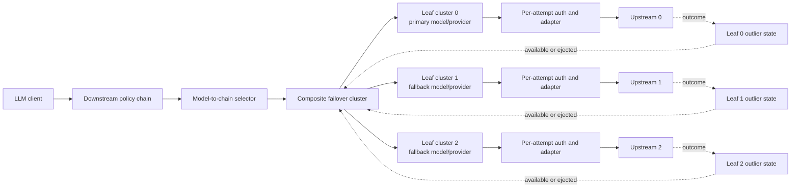
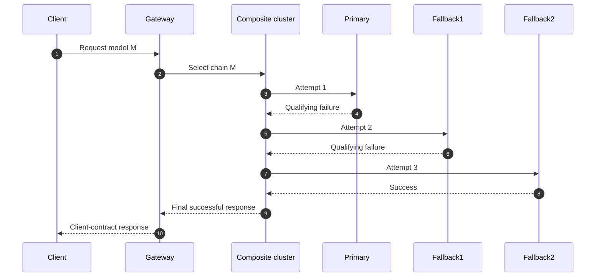
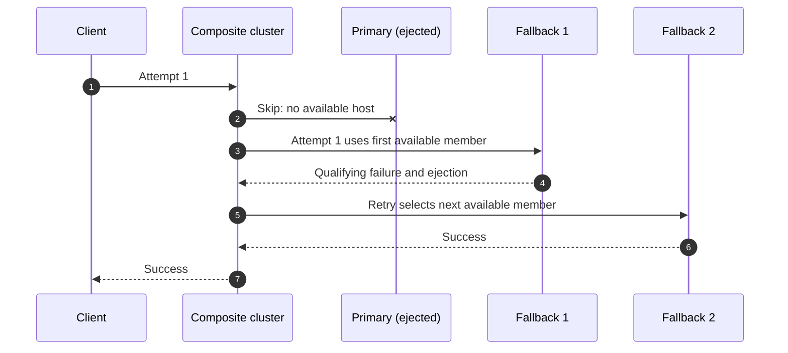

# LLM Model Failover — Architecture Review and Production Design

**Status:** Proposed  
**Scope:** LLM proxy operations  
**Primary data plane:** Envoy  
**Target runtime baseline:** Envoy 1.39 or later

## 1. Executive decision

The failover policy should select a **failover chain**, never an individual fallback. Envoy should own both in-request progression and cross-request target availability.

The proposed architecture uses:

- one **composite cluster** for each model-specific failover chain;
- one dedicated **logical leaf cluster** for every chain member;
- route-level retries for sequential attempts;
- leaf-cluster outlier detection for suspension and automatic recovery;
- an HTTP outlier-detection error matcher so configured statuses such as `429` can participate in suspension;
- explicit per-member metadata for model, provider, endpoint, base path, and transformation identity; and
- per-attempt policy execution that always starts from the immutable client request.

The downstream phase always dispatches to the composite cluster. It does not inspect suspension state and never bypasses the chain. If a leaf target is ejected, Envoy automatically skips it while preserving the rest of the chain.

## 2. Review of the current architecture

The current solution proves several important capabilities:

- a request can retry across providers;
- policies can execute separately for each upstream attempt;
- target-specific authentication and transformation can be applied on retries;
- the actual dialed member can be observed; and
- failover results can be attributed in analytics.

Those are valuable foundations. The principal weakness is that chain progression, member identity, and health ownership are divided between Envoy, downstream policy execution, upstream policy execution, and process-local state.

### 2.1 Findings

| Priority | Finding | Consequence |
|---|---|---|
| Critical | A suspended primary causes downstream routing directly to one fallback. | The remaining fallback chain is unavailable if that direct attempt fails. |
| Critical | The retry design combines an aggregate cluster with `previous_priorities`. Envoy documents priority-load retry plugins as incompatible with aggregate clusters. | Behavior depends on mechanics Envoy does not guarantee. |
| High | Suspension is owned by a policy-engine map while routing health is owned by Envoy. | Two independent routing views can disagree, and process replicas can select different targets. |
| High | A same-provider fallback can share the same real cluster as the primary. | The model attempt cannot be identified or suspended independently using cluster health. |
| High | Suspension identity is based on model and provider but not the physical upstream definition. | Regional or endpoint-specific targets can incorrectly share health state. |
| High | Direct fallback routing uses provider identity as the routing handle. | Provider identity and physical dial target can diverge when `upstreamDefinition` is used. |
| High | Upstream response bodies are configured as buffered for every attached chain. | Streaming responses lose first-token streaming and large responses add memory and latency pressure. |
| High | Per-attempt path reconstruction does not preserve the original query string. | Retried requests may not be semantically equivalent to the first attempt. |
| High | Retry count is calculated from the deepest chain on the route rather than the selected chain. | Shorter chains can receive retries beyond their intended depth. |
| Medium | Shared suspension state is retained in a process-global registry without route deletion cleanup. | Long-running processes can retain stale configuration state and memory. |
| Medium | Member resolution partly falls back to attempt count when multiple members share a cluster. | Health-based skipping and retries can make attempt number differ from chain position. |
| Medium | Arbitrary HTTP codes are accepted without an explicit replay-safety policy. | Retrying some client or application errors can duplicate cost or side effects. |
| Medium | There is no explicit per-attempt timeout allocation. | A slow primary can consume the entire request deadline and make configured fallbacks unreachable. |
| Medium | Internal routing and attempt headers need an explicit trust boundary. | A downstream client could influence retry behavior or attribution if internal headers are not sanitized. |
| Medium | Failover health is replica-local. | Requests reaching different Envoy replicas can temporarily make different routing decisions. |

## 3. Design principles

1. **One routing owner.** Envoy owns availability, target skipping, retries, and recovery.
2. **One health owner.** No separate policy-engine suspension map participates in routing.
3. **Always preserve the chain.** Downstream processing selects only a composite chain cluster.
4. **Identity is explicit.** A chain member is never inferred from provider name, URL, or attempt number.
5. **Health units match policy units.** Every independently suspendable member has its own logical leaf cluster.
6. **Retry from immutable input.** Every attempt is derived from the original client request, not the mutated output of a previous attempt.
7. **One overall deadline.** Retries consume a single bounded request budget.
8. **No retry after commitment.** Failover stops after response headers or bytes are committed to the client.
9. **Configuration is compiled and validated.** Invalid or ambiguous chains never reach the data plane.
10. **Behavior is observable.** Every attempt and every ejection can be explained.

## 4. Target architecture



### 4.1 Component responsibilities

| Component | Responsibility |
|---|---|
| Downstream policy | Validate the client request and select the chain for the requested model. |
| Composite cluster | Select the chain member for the current attempt and skip members with no available host. |
| Leaf cluster | Represent one independently routable and suspendable chain member. |
| Route retry policy | Decide which outcomes create another attempt and bound the number of attempts. |
| Outlier detection | Count target failures, eject targets, apply backoff, and return them to service. |
| Upstream attempt policies | Apply target-specific path, model, credentials, request transformation, and response transformation. |
| Telemetry | Record attempts, final target, retry causes, ejections, and latency. |

## 5. Compiled cluster model

### 5.1 Composite cluster per chain

Each `targets[]` entry compiles to one composite cluster. Its members are ordered exactly as authored:

```text
requested model: gpt-4o

composite chain
├── position 0: gpt-4o / openai-primary
├── position 1: gpt-4o-mini / openai-primary
├── position 2: claude-sonnet / anthropic-us
└── position 3: claude-sonnet / anthropic-eu
```

Envoy's composite cluster uses retry attempt number for deterministic progression. When the selected member has no available host, Envoy can skip forward to the next member.

### 5.2 Dedicated leaf cluster per chain member

A physical endpoint may appear in multiple logical leaf clusters. This duplication is deliberate.

The leaf identity is:

```text
deployment + route + chain + position + model + provider + upstreamDefinition
```

This guarantees:

- same-provider model fallbacks are distinct;
- two regions using the same credentials are distinct;
- two routes with different failure rules do not share outlier state;
- member metadata identifies an attempt without using attempt count; and
- ejection affects exactly the configured health scope.

The cluster name should use a stable, collision-resistant hash of the canonical identity rather than raw path text or only a list index.

### 5.3 Health scope

The initial health scope should be **route-chain-member**. It is the safest scope because different operations may use different status rules, thresholds, and latency expectations.

Provider-wide health can be added later as an explicit shared circuit breaker. It should not be an accidental consequence of reusing a leaf cluster.

## 6. Routing and retry behavior

### 6.1 Downstream selection

The downstream policy performs only these actions:

1. Read the requested model.
2. Find the configured chain.
3. Set the route target to that chain's composite cluster.

It does not read health state, choose a fallback, set a retry override, or route directly to a leaf cluster.

### 6.2 In-request progression



The route retry policy must specify:

- the exact outcomes that permit another attempt;
- `num_retries = selected chain length - 1`;
- per-attempt timeout behavior;
- retry backoff; and
- retry resource limits.

Because Envoy route configuration is selected before the body-based model is known, chains of different lengths should not share one route retry budget. The control plane should compile a route or route variant per selected chain, or use a cluster-level retry policy associated with each compiled composite chain. Using the maximum chain depth for all models is not acceptable.

### 6.3 Already-ejected members

For a new request, an ejected leaf has no available host. The composite cluster skips it and selects the next available member while keeping later members reachable.



For deterministic single-pass behavior, the initial contract should suspend a member on its first qualifying failure. A threshold greater than one can cause a composite retry to revisit the same member when an earlier member was already skipped. If multi-failure thresholds remain a requirement, they need a dedicated Envoy retry-selection extension or a documented allowance for repeated attempts. The recommended initial contract is therefore `suspendAfterFailures = 1`.

## 7. Suspension through Envoy outlier detection

### 7.1 Single source of truth

The policy-engine suspension registry is removed. Leaf-cluster outlier detection is the only state that determines whether a target is eligible.

Envoy provides:

- inline ejection after consecutive qualifying failures;
- separate handling for upstream responses and local transport failures;
- increasing ejection durations;
- a maximum ejection duration;
- automatic unejection; and
- optional ejection event logs.

### 7.2 Configurable HTTP status classification

The configured `statusCodes` are compiled into both:

1. the route retry condition; and
2. the leaf cluster's HTTP outlier-detection `error_matcher`.

The matcher reports matching responses to outlier detection as errors and non-matching responses as successes. This supports exact policy status sets, including `429`, without a second health-state implementation.

The two generated configurations must come from one normalized failure-classification object so they cannot drift.

### 7.3 Transport failures

Transport failures have no HTTP status and need an explicit contract. The recommended defaults are:

- connect failure: retry and count as a local-origin failure;
- connection reset: retry and count as a local-origin failure;
- refused stream: retry and count as a local-origin failure;
- per-attempt timeout: retry and count as a local-origin failure;
- client cancellation: do not retry and do not count against the target; and
- overall deadline expiry: do not start another attempt.

### 7.4 Required leaf settings

Conceptually, every leaf cluster needs:

```yaml
outlier_detection:
  consecutive_5xx: 1
  split_external_local_origin_errors: true
  consecutive_local_origin_failure: 1
  enforcing_consecutive_5xx: 100
  enforcing_consecutive_local_origin_failure: 100
  base_ejection_time: <suspendDuration>
  max_ejection_time: <maxSuspendDuration>
  max_ejection_percent: 100
  always_eject_one_host: true
  max_ejection_time_jitter: <bounded jitter>

common_lb_config:
  healthy_panic_threshold:
    value: 0
```

The exact-status error matcher is added to the leaf's HTTP protocol options.

`max_ejection_percent: 100` or `always_eject_one_host: true` is essential because a logical leaf often has one host. Disabling panic routing prevents an ejected host from being selected merely because cluster health is low.

### 7.5 Recovery

An ejected leaf returns automatically after its ejection period. Repeated ejections increase the period up to the configured maximum. Envoy gradually decreases the multiplier while the host remains healthy.

Active health checking may optionally accelerate recovery, but only when the health probe validates the same serving path and capability as real inference traffic. A shallow TCP or generic HTTP health check must not immediately uneject a model endpoint that is still failing inference requests.

## 8. Per-attempt identity and adaptation

### 8.1 Explicit member descriptor

Every leaf endpoint carries immutable metadata:

```yaml
chainId: <stable chain identifier>
memberId: <stable member identifier>
position: <zero-based position>
model: <effective model>
provider: <credential and adapter identity>
upstreamDefinition: <physical dial-target identity>
basePath: <resolved base path>
```

The upstream attempt policy reads the descriptor of the actual selected leaf. It does not infer identity from:

- retry attempt count;
- aggregate or composite cluster name alone;
- provider name;
- endpoint URL; or
- request path.

### 8.2 Immutable request replay

Each attempt is built from:

```text
original client request + selected member descriptor
```

It is never built from the transformed body or headers of the previous attempt.

For each attempt, the adapter must explicitly set or rebuild:

- authority and destination;
- path while preserving the original query string;
- effective model;
- provider credentials;
- provider-specific headers;
- request body shape; and
- content-length or transfer framing as necessary.

Provider-sensitive headers from a previous attempt must be removed before new credentials are applied.

### 8.3 Response handling

Qualifying failure responses are consumed by Envoy retry processing and are not exposed to the client. The final response is transformed from the serving provider's format into the client contract.

The effective model and provider are recorded using protected internal metadata. If an internal header is used as a transport mechanism, the gateway must strip any client-supplied value at ingress and remove the internal header before egress.

## 9. Timeouts and retry budget

### 9.1 Overall deadline

All attempts share one route deadline. No attempt may start after the remaining budget reaches zero.

### 9.2 Per-attempt deadlines

Without per-attempt bounds, the primary can consume the entire route deadline. The design should support either:

- one configured `perTryTimeout` for every member; or
- optional per-member attempt budgets validated so their sum plus retry backoff fits inside the overall deadline.

Recommended initial rule:

```text
perTryTimeout < overallTimeout
numRetries = chainLength - 1
total retry backoff is bounded
```

### 9.3 Retry resource protection

Retries increase provider traffic during incidents. Configure retry circuit breaking or a retry budget so failover traffic cannot exhaust all upstream capacity. Metrics must separate original requests from attempts.

## 10. Streaming behavior

### 10.1 Request streaming

Model selection and most cross-provider request transforms require the complete JSON request. The initial design may buffer the request body subject to a strict maximum size.

### 10.2 Response streaming

The response must not be globally buffered merely because failover is enabled.

- Before response commitment, a qualifying response status may trigger another attempt.
- After successful headers or response bytes are committed, no failover is allowed.
- Same-contract streaming responses pass through without buffering.
- Cross-provider stream transformation requires a streaming-capable adapter.
- If the selected adapter only supports buffered transformation, the configuration must either reject streaming for that chain or explicitly opt into buffering with documented latency and memory limits.

The processing mode should be derived from the actual policies attached to the selected member, not hard-coded to buffered request and response bodies for every failover route.

## 11. Policy contract

```yaml
operationPolicies:
  - name: model-failover
    version: v1
    paths:
      - path: /chat/completions
        methods: [POST]
    params:
      targets:
        - model: gpt-4o
          provider: openai-primary
          fallbacks:
            - model: gpt-4o-mini
              provider: openai-primary
            - model: claude-sonnet
              provider: anthropic
              upstreamDefinition: anthropic-us
            - model: claude-sonnet
              provider: anthropic
              upstreamDefinition: anthropic-eu
      retry:
        statusCodes: [429, 500, 502, 503, 504]
        transportFailures:
          - connect-failure
          - reset
          - refused-stream
          - per-try-timeout
        perTryTimeout: 5s
        backoff:
          base: 25ms
          max: 250ms
      suspension:
        afterFailures: 1
        baseDuration: 5s
        maxDuration: 40s
        jitter: 1s
```

### 11.1 Recommended contract changes

- Group retry and suspension options instead of mixing them at the top level.
- Use duration strings rather than integer seconds.
- Make transport failures explicit.
- Initially require `afterFailures: 1` for deterministic chain progression.
- Treat `provider` as credential/adapter identity only.
- Treat `upstreamDefinition` as physical destination identity only.
- Reject duplicate effective members within one chain.

## 12. Validation requirements

Reject a configuration when:

- a chain has no primary or no fallback;
- a primary model appears more than once for the same operation;
- a model, provider, or upstream definition cannot be resolved;
- a chain contains the same canonical member twice;
- the status list is empty or contains invalid or unsafe statuses;
- retry conditions and outlier error classification cannot be generated identically;
- the chain length exceeds the platform limit;
- the retry count does not match the chain length;
- the per-attempt and overall deadlines make later fallbacks unreachable;
- a cross-provider adapter does not support the operation's request or response mode;
- streaming is enabled but a required adapter only supports buffered transformation;
- a non-idempotent operation lacks an idempotency mechanism; or
- generated cluster identities collide.

## 13. Security invariants

- Remove client-supplied internal routing, retry, attempt-count, and attribution headers at ingress.
- Never use a downstream header value as an unchecked cluster name.
- Apply credentials only after the actual leaf member is selected.
- Remove all provider-specific credentials before applying the selected provider's credentials.
- Never log credentials, prompts, or completions through failover diagnostics.
- Make cross-provider and cross-region movement explicit and governable.
- Bound buffered body sizes and retry counts.
- Fail closed if required authentication or transformation cannot execute.

## 14. Observability

### 14.1 Per-request trace

Each attempt should record:

- chain ID and member ID;
- attempt number and configured position;
- requested and effective model;
- provider and upstream definition;
- outcome and retry reason;
- whether an earlier member was skipped as unavailable;
- per-attempt latency; and
- remaining request budget.

### 14.2 Metrics

- failover-eligible requests;
- attempts per client request;
- retries by reason;
- target ejections and unejections;
- fallback success rate by chain position;
- exhausted-chain responses;
- no-healthy-upstream responses;
- added latency and time to first token;
- buffered bytes; and
- retry-overflow or circuit-breaker rejection.

### 14.3 Ejection logs

Enable Envoy outlier-detection event logging. It provides the target, ejection type, enforcement status, and ejection count needed to explain why a member was skipped.

## 15. Replica behavior

Envoy outlier state is local to each data-plane replica. This is normally desirable: each replica reacts to the failures it observes without a control-plane dependency.

Replica-local state does mean two replicas can temporarily disagree. If strict global suspension becomes a demonstrated requirement, add a separate provider-health control plane that updates EDS health. Do not reintroduce a second request-path suspension map. The global mechanism should be authoritative, observable, and slower-moving than local outlier detection.

## 16. Exhaustion behavior

The behavior must be deterministic:

- If a chain member fails and another untried member is available, retry the next member.
- If every member is unavailable before an attempt starts, return `503 no healthy upstream` with an internal reason identifying chain exhaustion.
- If every attempted member returns a qualifying failure, return the final attempt's response unless platform error normalization is explicitly configured.
- Never restart at the primary after the retry budget is exhausted.
- Never silently retry a single leaf beyond the chain contract.

## 17. Compatibility and rollout

### Phase 1 — shadow compilation

Generate the proposed composite and leaf-cluster graph alongside the existing graph, validate it, and compare expected member selection without routing production traffic through it.

### Phase 2 — controlled data-plane validation

Exercise:

- first-attempt success;
- every individual status code;
- connect failure, reset, and timeout;
- primary already ejected;
- multiple consecutive ejected members;
- same-provider model fallback;
- same-provider regional fallback;
- cross-provider request and response transformation;
- streaming success;
- query-string preservation;
- policy-engine unavailability; and
- rolling configuration updates.

### Phase 3 — limited production

Enable selected non-streaming chains with attempt, ejection, cost, and latency dashboards.

### Phase 4 — streaming and broader availability

Enable only after every participating provider adapter demonstrates the required streaming behavior.

## 18. Acceptance matrix

| Scenario | Required outcome |
|---|---|
| Primary healthy | Primary serves the request. |
| Primary returns qualifying status | Next member is attempted. |
| Primary returns non-qualifying status | Response is returned without failover. |
| Primary already ejected | First available fallback is selected through the composite chain. |
| Selected fallback fails | Later fallback remains reachable. |
| Two earlier members ejected | First available later member is selected. |
| Same provider, different model | Effective model changes and health state remains member-specific. |
| Same provider, different region | Correct endpoint is dialed and region health remains independent. |
| Different provider | Old credentials are absent; new credentials and transformations are applied. |
| Query string present | Every attempt preserves it. |
| Per-attempt timeout | Next member is attempted only when overall budget remains. |
| Client cancels | No new attempt begins and target health is not penalized. |
| Successful streaming begins | No later failover is attempted. |
| All members unavailable | Deterministic `no healthy upstream` response. |
| Policy engine unavailable | Request fails closed before reaching a provider without required policies. |
| Rolling update | Old and new data-plane instances receive compatible configuration. |

## 19. Required proof tests before adoption

The following Envoy behaviors should be pinned by container-level tests against the shipped Envoy version:

1. Composite cluster progression across three or more members.
2. Skipping one and multiple ejected leaf clusters.
3. Interaction between a skipped member and the next retry attempt.
4. Exact-status outlier error matching, including `429`.
5. Local-origin failure ejection.
6. Single-host ejection with panic mode disabled.
7. Per-attempt upstream-filter execution on composite-selected leaves.
8. Availability of actual leaf endpoint metadata to the upstream policy.
9. Request-body replay and response-stream behavior across retries.
10. Ejection expiry, backoff, cap, and jitter.

No behavior that is only assumed from attempt count or cluster naming should be accepted without one of these tests.

## 20. Final recommendation

Adopt the composite-cluster architecture and make Envoy outlier detection the sole suspension mechanism. Compile every chain member into a dedicated leaf cluster, even when several members share one physical endpoint. Generate retry classification and health classification from the same normalized policy. Always enter the chain from downstream processing, and make every upstream attempt derive from immutable client input plus explicit member metadata.

For the initial production contract, require immediate suspension after one qualifying failure. This yields deterministic progression when earlier members are already unavailable. If configurable multi-failure thresholds are mandatory, treat that as a separate extension requiring a retry-selection mechanism that tracks the actual selected member rather than assuming attempt number equals chain position.
