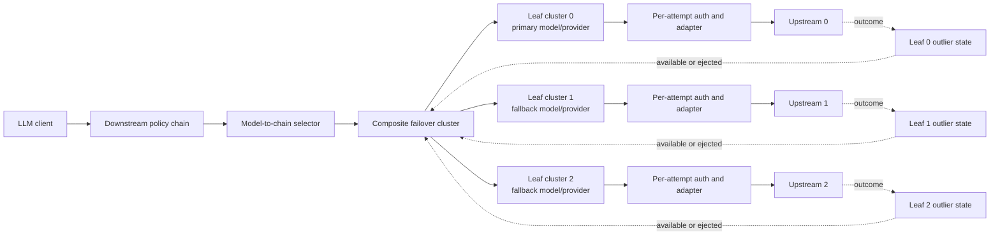
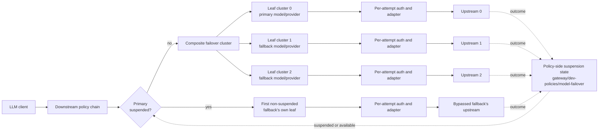
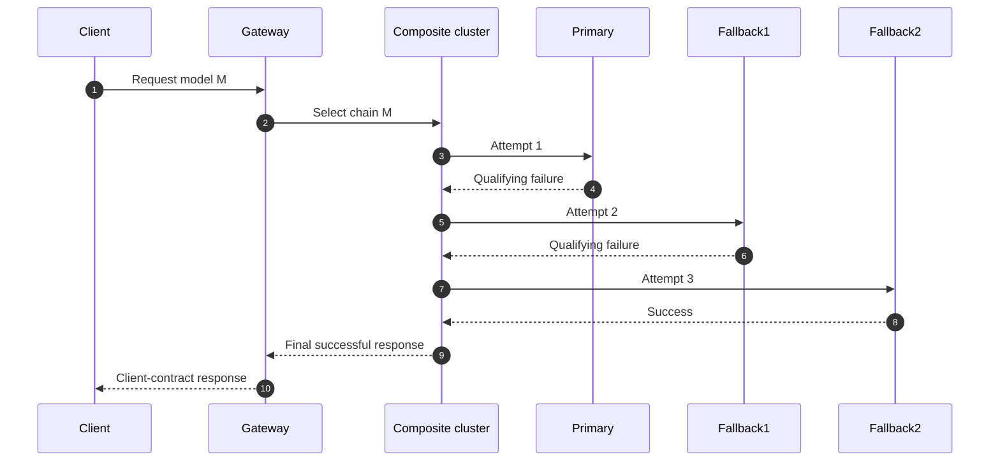
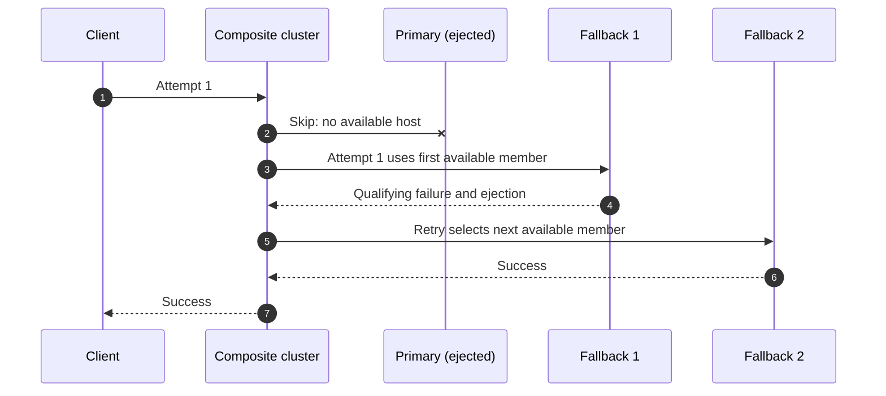
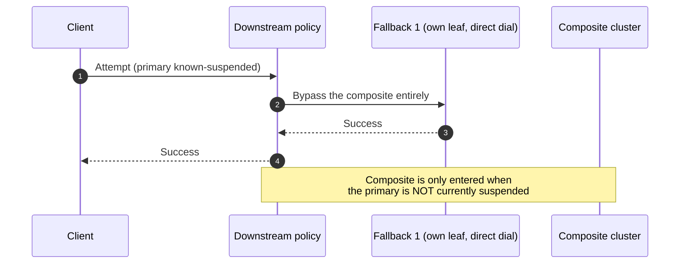

# LLM Model Failover — Architecture Review and Production Design

**Status:** Proposed  
**Scope:** LLM proxy operations  
**Primary data plane:** Envoy  
**Target runtime baseline:** Envoy 1.39 or later

## 0. Revision note (2026-09-23) — leaf outlier detection reverted to policy-side suspension

This document's central claim in §1, §6.3, §7, §15, §18, §19, and §20 — that Envoy leaf-cluster
`outlier_detection` can be the **sole** suspension mechanism, with the composite cluster
automatically skipping an ejected member for a fresh request — was implemented and then
**disproven by live testing against a real Envoy** (`gateway/dev-policies/run-outlier-threshold-proof.sh`).

**What actually happens.** `envoy.clusters.composite` selects a member purely by retry-attempt
count, never by host health (confirmed from the cluster type's own doc comment: "unlike the
standard aggregate cluster which uses health-based selection, the composite cluster uses the
retry attempt count to deterministically select which sub-cluster to route to"). Attempt 1 always
maps to position 0. If position 0's leaf has already been ejected by outlier detection from an
earlier request, Envoy's cluster/host selection fails *before* any upstream request is dispatched
("no healthy upstream", response flag `UH`) — and no `retry_on` value can retry that failure.
`reset-before-request` only covers a host that was selected and then reset before its request was
sent; Envoy has no supported way to retry when zero hosts were available to select from at all.
This is a confirmed, long-standing Envoy limitation, not a configuration gap — see
[envoyproxy/envoy#11307](https://github.com/envoyproxy/envoy/issues/11307) (closed unresolved; a
maintainer explains the load balancer's host set is fixed for the life of the request's routing
context). Re-enabling panic-threshold routing is not a fix either: Envoy's outlier-detection docs
confirm an ejected host becomes selectable again once panic routing engages, which for a
single-host leaf (healthy% always 0 or 100) means panic would immediately re-select the very host
that was just ejected.

**Net effect at the shipped default (`suspendAfterFailures: 1`, i.e. eject after one failure):**
every request landing during a primary's ejection window failed outright with `503`, instead of
failing over — the opposite of this document's stated goal. This is worse the deeper the
combinatorics of "was an earlier position already ejected before this request started" get, not
better, so it was never merely a "raise the threshold carefully" question (§6.3's original
framing).

**Decision.** Leaf clusters carry **no** `outlier_detection`/`CommonLbConfig` panic override at
all (`xds.configureFailoverLeafCircuitBreaker` in `failover_cluster.go` — the name change reflects
that it now only configures the per-leaf retry circuit breaker, §9.3). Cross-request suspension of
a known-bad primary is **policy-side again**, restoring the mechanism this document's §2.1 findings
table originally flagged as a weakness to eliminate (`gateway/dev-policies/model-failover`'s
`isSuspended`/`recordOutcome`/`backoffDuration`, which this refactor had disconnected from routing
but never actually deleted). `suspendAfterFailures` is no longer locked to `1` — it is genuinely
configurable again. `OnRequestBody` now bypasses a suspended primary and dispatches
`UpstreamName` directly at the first non-suspended fallback's own leaf cluster (with
`x-envoy-max-retries: 0`, since the route's composite-shaped `RetryPolicy` would otherwise retry
that single bypassed attempt against itself and mask a genuine failure as success), the same shape
the pre-this-redesign POC used. This requires the target leaf cluster's name to be registered in
the name-addressable upstream registry `policyxds` builds (`upstream_definition_paths` /
`upstreamDefTargets` in `pkg/policyxds/snapshot.go`) — otherwise the policy engine's `UpstreamName`
resolution reports the leaf as an unknown target and Envoy returns `503 NC cluster_not_found`.

Within-request retry progression (§6.2) is **unaffected and still correct** — that part of this
document's design is confirmed accurate by the same live test: attempt-count-driven advancement
through a healthy chain works exactly as §6.2 describes, with no cross-provider credential leakage
and no re-dial of an already-tried member.

The rest of this document is left as originally written, with inline pointers back to this section
at each place its outlier-detection-as-sole-mechanism premise no longer holds — both so the
document stays an honest record of what was tried, and because most of its content (§2–§5, §6.1–6.2,
§8–§14 except where noted, §16–§17) is unaffected by this reversal.

## 1. Executive decision

The failover policy should select a **failover chain**, never an individual fallback. Envoy should own both in-request progression and cross-request target availability.

The proposed architecture uses:

- one **composite cluster** for each model-specific failover chain;
- one dedicated **logical leaf cluster** for every chain member;
- route-level retries for sequential attempts;
- policy-side suspension and automatic recovery for cross-request target availability (see §0 — leaf-cluster outlier detection cannot do this job; Envoy's composite cluster selects purely by retry-attempt count, so an ejected leaf's own request never gets a chance to retry into the next member);
- explicit per-member metadata for model, provider, endpoint, base path, and transformation identity; and
- per-attempt policy execution that always starts from the immutable client request.

The downstream phase inspects suspension state before dispatching: if the chain's primary is
suspended, it bypasses the composite entirely and dispatches directly to the first non-suspended
fallback's own leaf cluster (§0, §7). Otherwise it dispatches to the composite cluster as
originally designed, and within-request progression across that composite proceeds exactly as §6.2
describes — Envoy does not skip an ejected member mid-chain because leaves are no longer ejected at
all; a target that has failed enough to warrant skipping is skipped by the downstream bypass before
the composite is ever entered, not by the composite itself.

## 2. Review of the current architecture

The current solution proves several important capabilities:

- a request can retry across providers;
- policies can execute separately for each upstream attempt;
- target-specific authentication and transformation can be applied on retries;
- the actual dialed member can be observed; and
- failover results can be attributed in analytics.

Those are valuable foundations. The principal weakness is that chain progression, member identity, and health ownership are divided between Envoy, downstream policy execution, upstream policy execution, and process-local state.

### 2.1 Findings

| Priority | Finding | Consequence |
|---|---|---|
| Critical | A suspended primary causes downstream routing directly to one fallback. | The remaining fallback chain is unavailable if that direct attempt fails. |
| Critical | The retry design combines an aggregate cluster with `previous_priorities`. Envoy documents priority-load retry plugins as incompatible with aggregate clusters. | Behavior depends on mechanics Envoy does not guarantee. |
| High | Suspension is owned by a policy-engine map while routing health is owned by Envoy. | Two independent routing views can disagree, and process replicas can select different targets. |
| High | A same-provider fallback can share the same real cluster as the primary. | The model attempt cannot be identified or suspended independently using cluster health. |
| High | Suspension identity is based on model and provider but not the physical upstream definition. | Regional or endpoint-specific targets can incorrectly share health state. |
| High | Direct fallback routing uses provider identity as the routing handle. | Provider identity and physical dial target can diverge when `upstreamDefinition` is used. |
| High | Upstream response bodies are configured as buffered for every attached chain. | Streaming responses lose first-token streaming and large responses add memory and latency pressure. |
| High | Per-attempt path reconstruction does not preserve the original query string. | Retried requests may not be semantically equivalent to the first attempt. |
| High | Retry count is calculated from the deepest chain on the route rather than the selected chain. | Shorter chains can receive retries beyond their intended depth. |
| Medium | Shared suspension state is retained in a process-global registry without route deletion cleanup. | Long-running processes can retain stale configuration state and memory. |
| Medium | Member resolution partly falls back to attempt count when multiple members share a cluster. | Health-based skipping and retries can make attempt number differ from chain position. |
| Medium | Arbitrary HTTP codes are accepted without an explicit replay-safety policy. | Retrying some client or application errors can duplicate cost or side effects. |
| Medium | There is no explicit per-attempt timeout allocation. | A slow primary can consume the entire request deadline and make configured fallbacks unreachable. |
| Medium | Internal routing and attempt headers need an explicit trust boundary. | A downstream client could influence retry behavior or attribution if internal headers are not sanitized. |
| Medium | Failover health is replica-local. | Requests reaching different Envoy replicas can temporarily make different routing decisions. |

## 3. Design principles

1. **One routing owner per concern.** Envoy owns within-request retry progression; the downstream
   policy owns cross-request suspension (§0, §7.6 — the original single-owner-for-everything
   version of this principle assumed Envoy could own suspension too, which it structurally cannot:
   the composite cluster has no way to skip a member for a request it hasn't started retrying yet).
2. **One health owner.** Policy-side suspension state (§7.6) is the only state that decides
   cross-request target availability — reverted from "no separate policy-engine suspension map
   participates in routing" (§0), since that map turned out to be required, not eliminable.
3. **Enter the chain deliberately.** Downstream processing selects a composite chain cluster when
   the chain's primary is available, or bypasses straight to a specific fallback's own leaf when it
   is currently suspended (§7.6) — not "only a composite chain cluster" unconditionally.
4. **Identity is explicit.** A chain member is never inferred from provider name, URL, or attempt number.
5. **Health units match policy units.** Every independently suspendable member has its own logical leaf cluster.
6. **Retry from immutable input.** Every attempt is derived from the original client request, not the mutated output of a previous attempt.
7. **One overall deadline.** Retries consume a single bounded request budget.
8. **No retry after commitment.** Failover stops after response headers or bytes are committed to the client.
9. **Configuration is compiled and validated.** Invalid or ambiguous chains never reach the data plane.
10. **Behavior is observable.** Every attempt and every ejection can be explained.

## 4. Target architecture

**Revised (§0, §7.6):** the original diagram below fed each leaf's outlier outcome back into the
composite cluster's own selection (`H0/H1/H2 -. available or ejected .-> Composite`) — this
feedback loop does not exist in Envoy for a composite cluster and is not part of the adopted
architecture. Kept for record; the adopted shape is the one below it.



Adopted architecture: the outcome feedback loop is policy-side, upstream of composite entry, not a
property of the composite cluster itself.



### 4.1 Component responsibilities

| Component | Responsibility |
|---|---|
| Downstream policy | Validate the client request, select the chain for the requested model, and choose whether to enter the full composite or a suffix composite past a suspended prefix (§7.6, §21.1). |
| Composite cluster | Select the chain member for the current *retry attempt* by attempt count — it cannot skip a member for a fresh request; skipping is the downstream policy's job. |
| Leaf cluster | Represent one independently identifiable chain member, always reached through the full composite or a suffix composite — never dispatched at by name. |
| Route retry policy | Decide which outcomes create another attempt and bound the number of attempts. |
| Policy-side suspension (§7.6) | Count target failures, suspend targets, apply backoff, and return them to service — replaces the "Outlier detection" row this table originally had, since leaf outlier detection does not perform this role (§0). |
| Upstream attempt policies | Apply target-specific path, model, credentials, request transformation, and response transformation. |
| Telemetry | Record attempts, final target, retry causes, suspensions, and latency. |

## 5. Compiled cluster model

### 5.1 Composite cluster per chain

Each `targets[]` entry compiles to one composite cluster. Its members are ordered exactly as authored:

```text
requested model: gpt-4o

composite chain
├── position 0: gpt-4o / openai-primary
├── position 1: gpt-4o-mini / openai-primary
├── position 2: claude-sonnet / anthropic-us
└── position 3: claude-sonnet / anthropic-eu
```

Envoy's composite cluster uses retry attempt number for deterministic progression. When the selected member has no available host, Envoy can skip forward to the next member.

### 5.2 Dedicated leaf cluster per chain member

A physical endpoint may appear in multiple logical leaf clusters. This duplication is deliberate.

The leaf identity is:

```text
deployment + route + chain + position + model + provider + upstreamDefinition
```

This guarantees:

- same-provider model fallbacks are distinct;
- two regions using the same credentials are distinct;
- member metadata identifies an attempt without using attempt count; and
- each member has its own position in every suffix composite the bypass can enter (§21.1),
  whether or not it physically shares an endpoint with another member.

(The original two further guarantees this list gave — "two routes with different failure rules do
not share outlier state" and "ejection affects exactly the configured health scope" — no longer
apply: leaves carry no outlier state at all, §0. Suspension scope is governed by policy-side
suspension's own key, `(model, provider)`, not by leaf cluster identity.)

The cluster name should use a stable, collision-resistant hash of the canonical identity rather than raw path text or only a list index.

### 5.3 Health scope

The initial health scope should be **route-chain-member**. It is the safest scope because different operations may use different status rules, thresholds, and latency expectations.

Provider-wide health can be added later as an explicit shared circuit breaker. It should not be an accidental consequence of reusing a leaf cluster.

## 6. Routing and retry behavior

### 6.1 Downstream selection

The downstream policy performs only these actions:

1. Read the requested model.
2. Find the configured chain.
3. Set the route target to that chain's composite cluster.

It does not read health state, choose a fallback, set a retry override, or route directly to a leaf cluster.

### 6.2 In-request progression



The route retry policy must specify:

- the exact outcomes that permit another attempt;
- `num_retries = selected chain length - 1`;
- per-attempt timeout behavior;
- retry backoff; and
- retry resource limits.

Because Envoy route configuration is selected before the body-based model is known, chains of different lengths should not share one route retry budget. The control plane should compile a route or route variant per selected chain, or use a cluster-level retry policy associated with each compiled composite chain. Using the maximum chain depth for all models is not acceptable.

### 6.3 Already-suspended members — superseded, see §0

**This section's premise is disproven by live testing — see §0 for the finding.** The composite
cluster does **not** skip an ejected member for a new request; it always selects position 0 for
attempt 1 regardless of health, and if position 0 has no available host the request fails
immediately with `503 no healthy upstream` with no retry into position 1 at all (Envoy has no
`retry_on` value that covers a pre-dispatch "no host to select" failure). The diagram below was the
originally proposed (and disproven) behavior; it is kept for record, with the actual behavior
underneath.



**What actually happens instead (adopted):** the downstream policy checks policy-side suspension
state *before* choosing whether to enter the composite at all. A suspended primary is never handed
to the composite in the first place — the request dispatches straight at the first non-suspended
fallback's own leaf cluster, single-shot (`x-envoy-max-retries: 0`, since a further failure there
has nothing configured left to skip to; if every member is suspended, dispatch falls through to
the composite anyway and Envoy's own retry exhaustion behavior applies, §16).



Because suspension is policy-side and evaluated once per fresh client request (not per Envoy
retry), there is no "threshold greater than one causes a composite retry to revisit an
already-skipped member" risk this section originally worried about — that risk was specific to
trying to make Envoy's own retry mechanism do the skipping. `suspendAfterFailures` is a normal,
freely configurable consecutive-failure threshold again (default `1`), not locked to `1` by a
composite-progression determinism requirement that turned out not to exist.

## 7. Suspension through policy-side state — supersedes this section's original design, see §0

**This section originally specified leaf-cluster outlier detection as the sole suspension
mechanism. That approach is reverted — see §0 for the live-tested reason.** The subsections below
are kept for record (§7.1–§7.5 as originally written) followed by the adopted replacement (§7.6).

### 7.1 Single source of truth (original, reverted)

The policy-engine suspension registry is removed. Leaf-cluster outlier detection is the only state that determines whether a target is eligible.

Envoy provides:

- inline ejection after consecutive qualifying failures;
- separate handling for upstream responses and local transport failures;
- increasing ejection durations;
- a maximum ejection duration;
- automatic unejection; and
- optional ejection event logs.

### 7.2 Configurable HTTP status classification (original, reverted)

The configured `statusCodes` are compiled into both:

1. the route retry condition; and
2. the leaf cluster's HTTP outlier-detection `error_matcher`.

The matcher reports matching responses to outlier detection as errors and non-matching responses as successes. This supports exact policy status sets, including `429`, without a second health-state implementation.

The two generated configurations must come from one normalized failure-classification object so they cannot drift.

Adopted instead: `statusCodes` still compiles into the route retry condition only (`isFailureStatus`
in `gateway/dev-policies/model-failover` reads the same configured set for its own suspension
bookkeeping) — one normalized failure-classification value is still shared, just between the route
`RetryPolicy` and the policy's `recordOutcome`, not between the route and a leaf `error_matcher`
that no longer exists.

### 7.3 Transport failures (original, reverted for the outlier-ejection framing; the retry-condition half is still open work)

Transport failures have no HTTP status and need an explicit contract. The recommended defaults are:

- connect failure: retry and count as a local-origin failure;
- connection reset: retry and count as a local-origin failure;
- refused stream: retry and count as a local-origin failure;
- per-attempt timeout: retry and count as a local-origin failure;
- client cancellation: do not retry and do not count against the target; and
- overall deadline expiry: do not start another attempt.

"Count as a local-origin failure" no longer applies (no leaf outlier detection exists to count
against). The retry half of this — whether the route's `RetryOn` includes `connect-failure`/
`reset`/`refused-stream`/`retriable-headers` alongside `5xx` — remains genuinely unimplemented: no
`transportFailures` config surface exists in the current policy/controller code, and the default
`RetryOn` is `5xx` only. This is a confirmed, separate gap (matches a customer-escalated bug on the
Classic Gateway's equivalent feature, WSO2 internal issue #18469) and is not resolved by this
revision.

### 7.4 Required leaf settings (original, reverted — no longer applies)

Conceptually, every leaf cluster needs:

```yaml
outlier_detection:
  consecutive_5xx: 1
  split_external_local_origin_errors: true
  consecutive_local_origin_failure: 1
  enforcing_consecutive_5xx: 100
  enforcing_consecutive_local_origin_failure: 100
  base_ejection_time: <suspendDuration>
  max_ejection_time: <maxSuspendDuration>
  max_ejection_percent: 100
  always_eject_one_host: true
  max_ejection_time_jitter: <bounded jitter>

common_lb_config:
  healthy_panic_threshold:
    value: 0
```

The exact-status error matcher is added to the leaf's HTTP protocol options.

`max_ejection_percent: 100` or `always_eject_one_host: true` is essential because a logical leaf often has one host. Disabling panic routing prevents an ejected host from being selected merely because cluster health is low.

Leaf clusters carry none of this now. `xds.configureFailoverLeafCircuitBreaker` sets only the
retry-resource-protection circuit breaker (§9.3, `MaxConcurrentRetries`) — no
`outlier_detection`, no `CommonLbConfig` panic override.

### 7.5 Recovery (original, reverted — no longer applies to leaves; §7.6 covers policy-side recovery)

An ejected leaf returns automatically after its ejection period. Repeated ejections increase the period up to the configured maximum. Envoy gradually decreases the multiplier while the host remains healthy.

Active health checking may optionally accelerate recovery, but only when the health probe validates the same serving path and capability as real inference traffic. A shallow TCP or generic HTTP health check must not immediately uneject a model endpoint that is still failing inference requests.

### 7.6 Adopted: policy-side suspension (`gateway/dev-policies/model-failover`)

Suspension state lives in the policy instance (`suspensionState`, keyed by `(model, provider)`),
tracked exactly as the pre-this-redesign POC tracked it:

- `recordOutcome` runs on every upstream attempt's response headers (`OnResponseHeaders`). A
  qualifying failure (`isFailureStatus`, same `statusCodes` set as the route's retry condition)
  increments a per-key consecutive-failure counter; a success clears it.
- Once the counter reaches `suspendAfterFailures` (default `1`), the key is suspended for
  `backoffDuration`'s computed window — `suspendDuration` on the first suspension, doubling on each
  further suspend-then-immediately-refail cycle, capped at 8x
  `suspendDuration`. The streak resets if a success intervenes, or if the previous suspension
  window plus one base `suspendDuration` has elapsed with no new qualifying failure — this bounds
  how long two otherwise-unrelated failures, far apart in time, can compound backoff (see
  `recordOutcome`'s doc comment for the specific incident this bound fixes).
- `isSuspended` performs a lazy check-and-clear against the current time — no background sweep.

`OnRequestBody`'s downstream branch consults `isSuspended(entry.Model, resolvedProvider)` before
choosing where to dispatch: not suspended → the composite cluster, exactly as §6.1/§6.2 describe;
suspended → walk `entry.Fallbacks` in order and dispatch directly at the first non-suspended
fallback's own leaf cluster (`fallback.ClusterName`, injected by the controller — §8.1's per-member
descriptor already carried this field, unused until this revision), with `x-envoy-max-retries: 0`.
If every member is suspended, dispatch falls through to the composite anyway (§16's exhaustion
behavior applies from there).

This is **replica-local** state, same caveat as §15 describes for the reverted approach — each
gateway-runtime replica's policy-engine instance suspends independently based on what it has
personally observed failing. §15's closing guidance (a separate provider-health control plane if
strict global suspension becomes a demonstrated requirement, never a second request-path suspension
map) still applies — this revision does not add a second map; it is the one suspension mechanism,
replacing the leaf-outlier approach rather than coexisting with it.

## 8. Per-attempt identity and adaptation

### 8.1 Explicit member descriptor

Every leaf endpoint carries immutable metadata:

```yaml
chainId: <stable chain identifier>
memberId: <stable member identifier>
position: <zero-based position>
model: <effective model>
provider: <credential and adapter identity>
upstreamDefinition: <physical dial-target identity>
basePath: <resolved base path>
```

The upstream attempt policy reads the descriptor of the actual selected leaf. It does not infer identity from:

- retry attempt count;
- aggregate or composite cluster name alone;
- provider name;
- endpoint URL; or
- request path.

### 8.2 Immutable request replay

Each attempt is built from:

```text
original client request + selected member descriptor
```

It is never built from the transformed body or headers of the previous attempt.

For each attempt, the adapter must explicitly set or rebuild:

- authority and destination;
- path while preserving the original query string;
- effective model;
- provider credentials;
- provider-specific headers;
- request body shape; and
- content-length or transfer framing as necessary.

Provider-sensitive headers from a previous attempt must be removed before new credentials are applied.

### 8.3 Response handling

Qualifying failure responses are consumed by Envoy retry processing and are not exposed to the client. The final response is transformed from the serving provider's format into the client contract.

The effective model and provider are recorded using protected internal metadata. If an internal header is used as a transport mechanism, the gateway must strip any client-supplied value at ingress and remove the internal header before egress.

## 9. Timeouts and retry budget

### 9.1 Overall deadline

All attempts share one route deadline. No attempt may start after the remaining budget reaches zero.

### 9.2 Per-attempt deadlines

Without per-attempt bounds, the primary can consume the entire route deadline. The design should support either:

- one configured `perTryTimeout` for every member; or
- optional per-member attempt budgets validated so their sum plus retry backoff fits inside the overall deadline.

Recommended initial rule:

```text
perTryTimeout < overallTimeout
numRetries = chainLength - 1
total retry backoff is bounded
```

### 9.3 Retry resource protection

Retries increase provider traffic during incidents. Configure retry circuit breaking or a retry budget so failover traffic cannot exhaust all upstream capacity. Metrics must separate original requests from attempts.

## 10. Streaming behavior

### 10.1 Request streaming

Model selection and most cross-provider request transforms require the complete JSON request. The initial design may buffer the request body subject to a strict maximum size.

### 10.2 Response streaming

The response must not be globally buffered merely because failover is enabled.

- Before response commitment, a qualifying response status may trigger another attempt.
- After successful headers or response bytes are committed, no failover is allowed.
- Same-contract streaming responses pass through without buffering.
- Cross-provider stream transformation requires a streaming-capable adapter.
- If the selected adapter only supports buffered transformation, the configuration must either reject streaming for that chain or explicitly opt into buffering with documented latency and memory limits.

The processing mode should be derived from the actual policies attached to the selected member, not hard-coded to buffered request and response bodies for every failover route.

## 11. Policy contract

```yaml
operationPolicies:
  - name: model-failover
    version: v1
    paths:
      - path: /chat/completions
        methods: [POST]
    params:
      targets:
        - model: gpt-4o
          provider: openai-primary
          fallbacks:
            - model: gpt-4o-mini
              provider: openai-primary
            - model: claude-sonnet
              provider: anthropic
              upstreamDefinition: anthropic-us
            - model: claude-sonnet
              provider: anthropic
              upstreamDefinition: anthropic-eu
      retry:
        statusCodes: [429, 500, 502, 503, 504]
        transportFailures:
          - connect-failure
          - reset
          - refused-stream
          - per-try-timeout
        perTryTimeout: 5s
        backoff:
          base: 25ms
          max: 250ms
      suspension:
        afterFailures: 1
        baseDuration: 5s
        maxDuration: 40s
        jitter: 1s
```

### 11.1 Recommended contract changes

- Group retry and suspension options instead of mixing them at the top level.
- Use duration strings rather than integer seconds.
- Make transport failures explicit.
- `afterFailures` defaults to `1` but is freely configurable (§0, §7.6, §20) — the original
  requirement to lock it at `1` assumed Envoy's composite retry mechanism needed to do the skipping;
  it doesn't, since skipping is policy-side now.
- Treat `provider` as credential/adapter identity only.
- Treat `upstreamDefinition` as physical destination identity only.
- Reject duplicate effective members within one chain.

## 12. Validation requirements

Reject a configuration when:

- a chain has no primary or no fallback;
- a primary model appears more than once for the same operation;
- a model, provider, or upstream definition cannot be resolved;
- a chain contains the same canonical member twice;
- the status list is empty or contains invalid or unsafe statuses;
- the route retry condition and the policy's own `isFailureStatus` cannot be generated from the
  same normalized status set (revised from "retry conditions and outlier error classification" —
  there is no longer a leaf outlier error classification to keep in sync, §0, §7.2);
- the chain length exceeds the platform limit;
- the retry count does not match the chain length;
- the per-attempt and overall deadlines make later fallbacks unreachable;
- a cross-provider adapter does not support the operation's request or response mode;
- streaming is enabled but a required adapter only supports buffered transformation;
- a non-idempotent operation lacks an idempotency mechanism; or
- generated cluster identities collide.

## 13. Security invariants

- Remove client-supplied internal routing, retry, attempt-count, and attribution headers at ingress.
- Never use a downstream header value as an unchecked cluster name.
- Apply credentials only after the actual leaf member is selected.
- Remove all provider-specific credentials before applying the selected provider's credentials.
- Never log credentials, prompts, or completions through failover diagnostics.
- Make cross-provider and cross-region movement explicit and governable.
- Bound buffered body sizes and retry counts.
- Fail closed if required authentication or transformation cannot execute.

## 14. Observability

### 14.1 Per-request trace

Each attempt should record:

- chain ID and member ID;
- attempt number and configured position;
- requested and effective model;
- provider and upstream definition;
- outcome and retry reason;
- whether an earlier member was skipped as unavailable;
- per-attempt latency; and
- remaining request budget.

### 14.2 Metrics

- failover-eligible requests;
- attempts per client request;
- retries by reason;
- target suspensions and un-suspensions (§7.6 — revised from "ejections and unejections"; this is
  now policy-side state, not an Envoy outlier-detection stat, so it needs its own metric emitted
  from `recordOutcome`/`isSuspended` rather than scraped from Envoy);
- fallback success rate by chain position;
- exhausted-chain responses;
- no-healthy-upstream responses;
- added latency and time to first token;
- buffered bytes; and
- retry-overflow or circuit-breaker rejection.

### 14.3 Suspension logs (revised from "Ejection logs" — see §0)

Envoy outlier-detection event logging no longer applies (leaves carry no outlier detection). The
equivalent record — target, suspend/resume transition, and the consecutive-failure count that
triggered it — must instead be logged from the policy's own `recordOutcome`/`isSuspended`
transitions (§7.6), since that is now the only place this state exists.

## 15. Replica behavior

Policy-side suspension state is local to each gateway-runtime replica's policy-engine instance
(§0, §7.6 — this section originally described Envoy leaf-outlier state before that mechanism was
reverted; the same replica-locality property holds for the adopted policy-side state, since it also
lives in an in-process map, not a shared store). This is normally desirable: each replica reacts to
the failures it observes without a control-plane dependency.

Replica-local state does mean two replicas can temporarily disagree. If strict global suspension becomes a demonstrated requirement, add a separate provider-health control plane that updates EDS health. Do not reintroduce a second request-path suspension map alongside this one. The global mechanism should be authoritative, observable, and slower-moving than the local policy-side state.

## 16. Exhaustion behavior

The behavior must be deterministic:

- If a chain member fails and another untried member is available, retry the next member.
- If every member is unavailable before an attempt starts, return `503 no healthy upstream` with an internal reason identifying chain exhaustion.
- If every attempted member returns a qualifying failure, return the final attempt's response unless platform error normalization is explicitly configured.
- Never restart at the primary after the retry budget is exhausted.
- Never silently retry a single leaf beyond the chain contract.

## 17. Compatibility and rollout

### Phase 1 — shadow compilation

Generate the proposed composite and leaf-cluster graph alongside the existing graph, validate it, and compare expected member selection without routing production traffic through it.

### Phase 2 — controlled data-plane validation

Exercise:

- first-attempt success;
- every individual status code;
- connect failure, reset, and timeout;
- primary already suspended (bypass dispatches at the first non-suspended fallback's own leaf — §7.6);
- multiple consecutive suspended members;
- same-provider model fallback;
- same-provider regional fallback;
- cross-provider request and response transformation;
- streaming success;
- query-string preservation;
- policy-engine unavailability; and
- rolling configuration updates.

### Phase 3 — limited production

Enable selected non-streaming chains with attempt, ejection, cost, and latency dashboards.

### Phase 4 — streaming and broader availability

Enable only after every participating provider adapter demonstrates the required streaming behavior.

## 18. Acceptance matrix

| Scenario | Required outcome |
|---|---|
| Primary healthy | Primary serves the request. |
| Primary returns qualifying status | Next member is attempted. |
| Primary returns non-qualifying status | Response is returned without failover. |
| Primary already suspended (§0, §7.6) | First non-suspended fallback is selected via the downstream policy-side bypass, dispatched directly at that fallback's own leaf cluster — not through the composite chain, which cannot skip an ejected/suspended member on its own. |
| Selected fallback (bypassed) also fails | No further in-request retry — the bypass is single-shot by design (§7.6); the client sees this fallback's failure response. Only entering the composite (primary not suspended) gets the full within-request retry cascade of §6.2. |
| Two earlier members suspended | Downstream walks `entry.Fallbacks` in order and dispatches at the first non-suspended one. |
| Same provider, different model | Effective model changes and health state remains member-specific. |
| Same provider, different region | Correct endpoint is dialed and region health remains independent. |
| Different provider | Old credentials are absent; new credentials and transformations are applied. |
| Query string present | Every attempt preserves it. |
| Per-attempt timeout | Next member is attempted only when overall budget remains. |
| Client cancels | No new attempt begins and target health is not penalized. |
| Successful streaming begins | No later failover is attempted. |
| All members unavailable | Deterministic `no healthy upstream` response. |
| Policy engine unavailable | Request fails closed before reaching a provider without required policies. |
| Rolling update | Old and new data-plane instances receive compatible configuration. |

## 19. Required proof tests before adoption

The following Envoy behaviors should be pinned by container-level tests against the shipped Envoy version:

1. **Composite cluster progression across three or more members. — DONE, CONFIRMED (2026-09-23).**
   Live-tested via `gateway/dev-policies/run-outlier-threshold-proof.sh` Test 1: a single primary
   failure correctly advances attempt 2 to position 1 (not a re-dial of position 0, not a skip to
   position 2). Matches §6.2 exactly.
2. ~~Skipping one and multiple ejected leaf clusters.~~ **Superseded — see §0.** Envoy's composite
   cluster does not do this at all; there is nothing to pin here because the behavior this item
   describes does not exist. The equivalent capability (skipping a known-bad primary) is now a
   policy-side bypass, covered by `modelfailover_test.go`'s suspension tests instead of a container
   xDS proof test.
3. **Interaction between a skipped member and the next retry attempt. — DONE, DISPROVEN
   (2026-09-23).** This is the test that produced §0's finding: driving a leaf to ejection and then
   sending a fresh request through the composite does not "skip" the ejected member — it fails the
   whole request immediately with `503 no healthy upstream`, with zero attempts ever reaching the
   next position. See §0 for the full mechanism and citation.
4. Exact-status outlier error matching, including `429`. **No longer applicable — leaves carry no
   outlier error matcher (§7.4).** `statusCodes` still drives the route's own retry condition and
   the policy's `isFailureStatus`, both covered by existing unit tests, not a live proof test.
5. ~~Local-origin failure ejection.~~ **No longer applicable — see item 4.**
6. ~~Single-host ejection with panic mode disabled.~~ **No longer applicable — see item 4.**
7. Per-attempt upstream-filter execution on composite-selected leaves. Still required, still
   unpinned by a live test beyond the manual verification in §0's live session (credential/body
   correctness confirmed for both a composite-routed attempt and a bypassed direct-leaf attempt).
8. Availability of actual leaf endpoint metadata to the upstream policy. Still required, confirmed
   working for the bypass path too (`resolveAttemptForCluster`'s fallback-matching branch, exercised
   live in §0's verification — `selected_provider`/`selected_model` seeded correctly on a bypassed
   attempt).
9. Request-body replay and response-stream behavior across retries. Still required, not yet pinned
   by a live test.
10. ~~Ejection expiry, backoff, cap, and jitter.~~ **Re-scoped to policy-side suspension expiry,
    backoff, and cap (§7.6)** — live-verified once in §0's session (suspend → bypass with correct
    credentials → suspendDuration expires → primary retried again, all HTTP 200) but not yet a
    committed container-level test; jitter does not apply (policy-side backoff is deterministic,
    not jittered).

No behavior that is only assumed from attempt count or cluster naming should be accepted without one of these tests.

## 20. Final recommendation (revised 2026-09-23 — see §0)

Adopt the composite-cluster architecture for **within-request** progression — this part is
confirmed correct by live testing (§19 item 1). Compile every chain member into a dedicated leaf
cluster, even when several members share one physical endpoint; this identity work is unaffected by
§0's reversal and stays exactly as designed.

Make **policy-side suspension** (§7.6), not Envoy outlier detection, the sole cross-request
suspension mechanism — the reverse of this section's original recommendation. Leaf clusters carry
no `outlier_detection`. `statusCodes` still generates one normalized failure classification, but it
now feeds the route's `RetryPolicy` and the policy's own `isFailureStatus`, not a route/leaf pair.
Always enter the composite from downstream processing when the chain's primary is not currently
suspended; when it is, bypass the composite entirely and dispatch directly at the first
non-suspended fallback's own leaf. Every upstream attempt — composite-routed or bypassed — still
derives from immutable client input plus explicit member metadata, exactly as originally specified.

`suspendAfterFailures` no longer needs to be locked to `1` for determinism — that constraint applied
only to the (now-abandoned) attempt at making Envoy's own composite-retry mechanism do the skipping.
It defaults to `1` but is a normal operator-configurable consecutive-failure threshold.

## 21. Suffix composites and the ECI #18469 circuit-breaker rewrite (2026-09-23)

Two rounds of work landed after §0–§20 above, on the same "policy-side suspension is the sole
cross-request mechanism" foundation §0 established.

### 21.1 Suffix composite clusters (extends §7.6's bypass)

§0/§7.6's bypass dispatches straight at the first non-suspended fallback's own **leaf** cluster with
`x-envoy-max-retries: 0` — a single-shot attempt with no further in-request retry if that fallback
also fails. This is now improved: for every fallback position `i` in a chain, the controller compiles
one additional composite cluster (`xds.SuffixCompositeClusterName`) covering `members[i:]` — every
member from that position through the end of the chain, reusing the existing leaf clusters (linear
cluster count in the number of fallbacks, not combinatorial). The bypass now always dispatches at this
suffix composite (`FailoverTarget.SuffixCluster`), with `x-envoy-max-retries` corrected to that
suffix's own remaining member count. A failure of the bypassed-to member can now retry into the rest
of the chain within the same request, exactly like entering the full chain at position 0 does —
recovering the retry depth the original bypass gave up. The bare-leaf dispatch is gone entirely: the
controller always injects `SuffixCluster`, and model-failover has never shipped, so there is no older
payload to stay compatible with. A fallback without one counts as blocked. Every suffix composite
name must be registered in `policyxds`'s name-addressable upstream registry, or Envoy returns
`503 NC cluster_not_found` for the bypass; leaf clusters are no longer registered, since nothing
dispatches at them by name any more. Member resolution on the upstream side is likewise entry-point
only: an attempt is identified from its aggregate or suffix cluster name plus the leaf Envoy dialed.

### 21.2 Circuit-breaker rewrite against customer issue wso2-enterprise/wso2-apim-internal#18469

A pasted external review of the suffix-composite implementation (measured against `wso2-apim-internal#18469`'s
full circuit-breaker ask) raised nine findings. All nine were addressed in
`gateway/dev-policies/model-failover/modelfailover.go` (config plumbing mirrored in
`gateway-controller/pkg/transform/model_failover_policy.go`'s `modelFailoverParams`); two are
structural limitations of this stack rather than code defects, documented honestly below instead of
worked around.

**#2 — fast exhaustion.** Previously, once every fallback was suspended, `OnRequestBody` fell through
to the full composite with a full retry budget anyway — silently spending an entire retry chain
against members already known to be failing. It now returns `policy.ImmediateResponse{StatusCode: 503}`
directly from the downstream phase instead, short-circuiting the whole policy chain without
dispatching to Envoy's router at all.

**#4/#5 — rolling failure-rate, latency, and half-open recovery.** `ModelFailoverParams` gained two
optional thresholds, `failureRateThresholdPercent` and `latencyThresholdMs`, each opt-in
(`<=0`/omitted disables that rule) and additive to the original `suspendAfterFailures`
consecutive-count trigger — any one of them can independently suspend a target via the same shared
backoff-streak escalation (`triggerSuspensionLocked`). Everything about how the rules measure is fixed
rather than author-facing, so a route author only states when a target is unhealthy: a 60s window in
10 lazily-rotated buckets (`rollingWindow`, matching this file's no-background-sweep, lazy-expiry
style), at least 20 attempts in the window before either rule is evaluated, and p95 (nearest-rank)
for latency — at 20 samples that is the second-slowest, so one outlier never trips it. A suspension
clears the target's windows, so it is judged afresh once it recovers. Latency is self-measured,
stashing an `OnRequestHeaders` timestamp into `SharedContext.Metadata` and reading it back in
`OnResponseHeaders` of the *same* upstream attempt — the SDK has no latency/duration field of its own.
Half-open recovery is always on: when a suspension expires, exactly one request is let through as a
probe (`allowRequest`/`completeProbe`) while every other request still skips the target; its success
closes the circuit, its failure reopens it with the window doubled. A probe whose outcome never
arrives (a transport failure or client cancel never reaches `recordOutcome`) is released after a 60s
lease, so it can't hold a target half-open forever.

**#6 — suspension key granularity.** `suspensionKey` was `model|provider`; validation-time duplicate-
member detection (`canonicalMember` in `gateway-controller`) already includes `upstreamDefinition`
too, since two members can share a (model, provider) pair yet dial genuinely different physical
backends. The key is now `model|provider|upstreamDefinition` throughout.

**#7 — state lifecycle.** The shared-suspension registry (`sharedSuspensionRegistry`, keyed by
chain) had no eviction at all. It's now evicted by idle time (`idleEvictionHorizon`, 24h) rather than
precisely on route deletion — this package has no route-deletion hook to observe, only `GetPolicy`
calls that *build* a chain (once per redeploy, not per request), so this approximates "no redeploy
touched this route's model-failover config in 24h", not "no traffic in 24h". A live, stable,
non-redeployed route also ages out and loses its accumulated state, which is a reset to a clean
slate, not a correctness bug. Per-target-key maps within one chain's state were deliberately left
unbounded-by-design: their keys come from that chain's own static `Targets`/`Fallbacks` config, not
per-request input, so they can't grow without bound the way the chain-level registry entry itself
could if never evicted.

**#8 — observability.** The SDK exposes no logger/metrics interface to policies — only
`AnalyticsMetadata` (present on every response action) and, for anything else, the standard library.
Circuit state transitions (suspend, with a `reason` field distinguishing which trigger fired; close;
half-open probe grants; chain exhaustion) now log via `log/slog`'s default handler
(`circuitLogger()`). The escalated-attempt response additionally carries `AnalyticsMetadata` tagging
the resolved chain position and model, since that's the one per-request telemetry surface available.

**#9 — test coverage.** New unit tests cover #2, #6, #4/#5 (rate rule threshold/minimum-samples,
latency consecutive-breach, half-open grant/close/reopen), and #7 (idle registry eviction) in
`modelfailover_test.go`. **Not done in this pass:** the "real Envoy" container-level proof tests §19
already calls for (an open member mid-composite, all members open, connection refusal/reset, a
connected-but-hung upstream, half-open concurrency under live traffic) — those require a rebuilt
image and live curl-based verification, the same live-testing pattern §0/§19 used, and were not run
for this rewrite. This is a real gap, not an oversight to gloss over: the rolling/latency/half-open
state machine is unit-tested in isolation, not yet proven against a live Envoy the way §0's
suspension bypass was.

**#1 — mid-chain skip within an already-selected composite/suffix — STRUCTURAL LIMITATION, not
fixed.** `OnRequestBody`'s suspension check only covers the ENTRY (or, in the bypass loop, the
fallback chosen as the new entry point) — it never checks whether some LATER member inside the
composite/suffix it just routed into is *also* currently suspended. Once a request enters a
composite cluster, `envoy.clusters.composite` selects the next member purely by retry-attempt count
(§0's own finding), never by this policy's suspension state, and there is no hook in the stock Envoy
retry path — nor in this SDK's `ImmediateResponse`, which terminates the *whole* client request
rather than "skip this one member" (see `sdk/core/policy/v1alpha2/action.go`) — that lets a policy
skip an individual known-bad member mid-attempt inside a multi-member composite. The suffix-composite
mechanism (§21.1) mitigates the common case — a suspended *prefix* is skipped entirely by choosing a
later entry point — but can't skip a suspended member in the *middle* of an otherwise-healthy suffix
without either combinatorial suffix generation (rejected: exponential cluster count for a chain of
any real depth) or a custom Envoy extension, which is exactly what
`docs/superpowers/specs/2026-09-23-llm-model-failover-implementation-spec.md` proposes and this
rewrite does not implement.

**#3 — transport failures (connection refusal, timeout, reset, a connected-but-hung upstream) never
reach circuit state — STRUCTURAL LIMITATION, not fixed.** `OnResponseHeaders` is the *only* place an
outcome is ever recorded, and it only runs when Envoy delivers an actual upstream response through
the ext_proc filter's response-header phase. Confirmed structurally rather than merely
unimplemented: this deployment's `go-control-plane` build's `ExternalProcessor` proto has **no**
`process_on_local_reply`-equivalent field at all (checked its full field list) to opt a local reply
into ext_proc processing, and Envoy's documented default is that ext_proc, like other HTTP filters,
is not invoked for local replies (locally-generated timeouts, connection failures, resets). Fixing
this needs an Envoy/go-control-plane capability this deployment doesn't have — not a change to
`modelfailover.go`.

**Schema note.** The author-facing circuit fields are deliberately few and flat: `suspendDuration`,
`suspendAfterFailures`, `failureRateThresholdPercent`, `latencyThresholdMs`, plus `perTryTimeoutMs`
for Envoy's per-attempt budget. Window length, sample minimum, percentile, backoff cap (8x), half-open
probe count, retry backoff (Envoy's 25ms default) and the per-leaf retry ceiling (1024) are fixed
internal defaults. `2026-09-23-llm-model-failover-implementation-spec.md` proposed a nested
`failurePolicy`/`latencyPolicy`/`recoveryPolicy` shape exposing all of these; that is superseded.** These 11 new fields use a flat naming style
matching `ModelFailoverParams`'s existing convention (`failureRateWindowSeconds`, not a nested
`failurePolicy: {windowSeconds: ...}`). `2026-09-23-llm-model-failover-implementation-spec.md` (the
untracked, not-written-by-this-session document reviewed alongside this rewrite) proposes a nested
`failurePolicy`/`latencyPolicy`/`recoveryPolicy` shape instead. This rewrite deliberately did not
adopt that nesting, to avoid a much larger parallel schema rewrite across both Go modules — flagged
here as a naming/schema divergence between the two documents, not yet raised with or decided by the
user.
